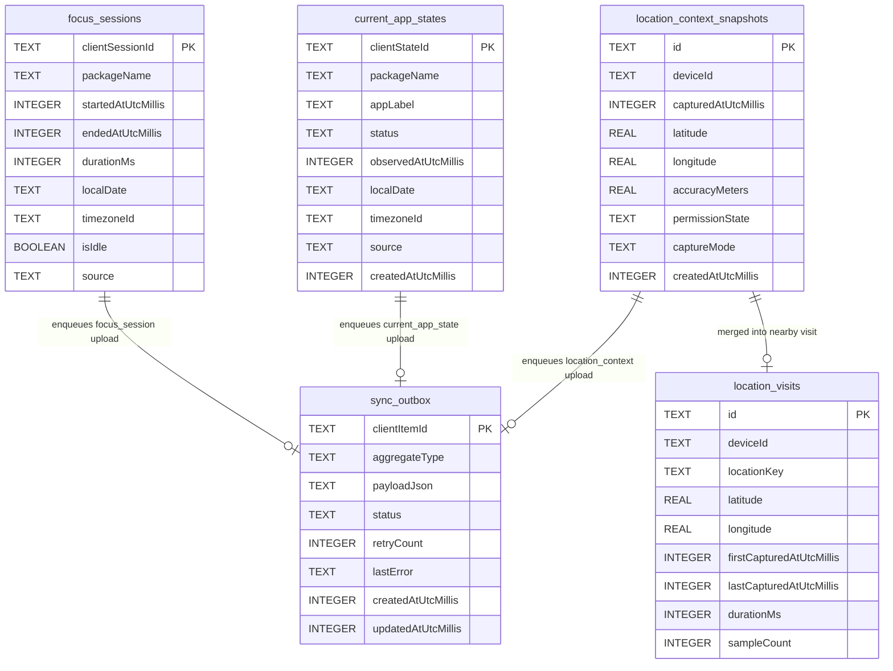
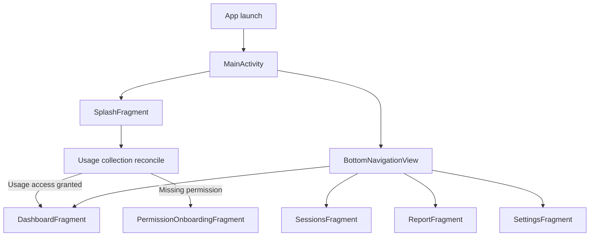
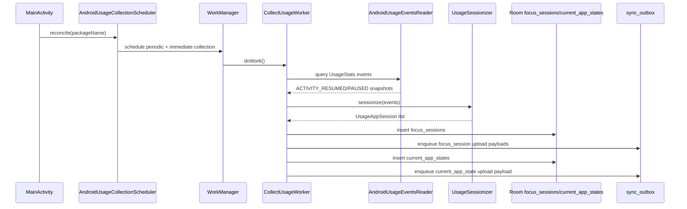
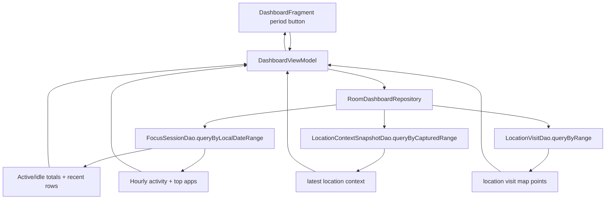
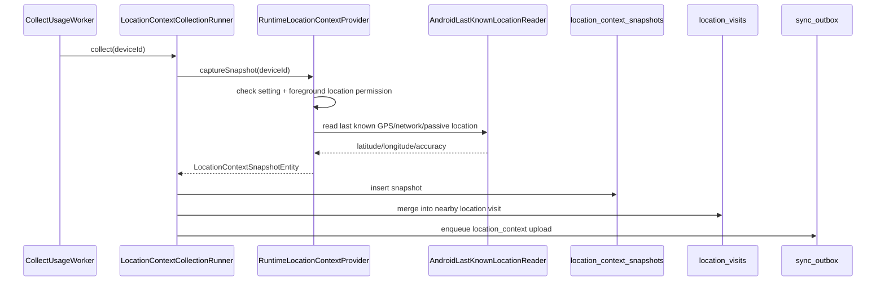
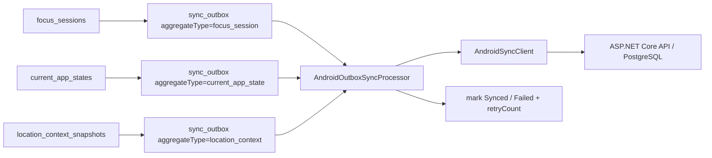
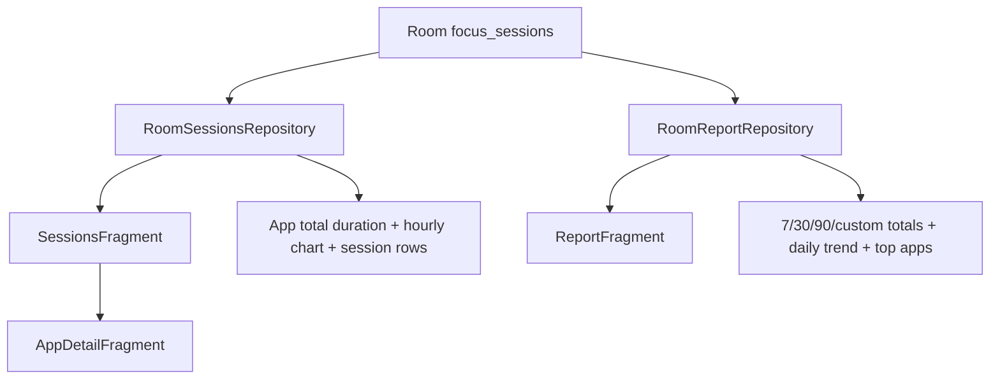

# Android Feature Map

This document maps the Android app functionality to implementation files,
Room database tables, and runtime flows.

The Android MVP is Kotlin + XML/View based. It uses UsageStatsManager and
WorkManager for privacy-safe app usage metadata collection. It must not collect
typed text, passwords, messages, form input, screen contents, clipboard
contents, or global touch coordinates.

## Feature Map

| Feature | Purpose | Code |
|---|---|---|
| Main shell and bottom navigation | Hosts Splash, permission onboarding, Dashboard, Sessions, Report, and Settings fragments. | [MainActivity.kt](../android/app/src/main/java/com/woong/monitorstack/MainActivity.kt), [activity_main.xml](../android/app/src/main/res/layout/activity_main.xml) |
| Splash screen | Initial loading screen before permission/dashboard routing. | [SplashFragment.kt](../android/app/src/main/java/com/woong/monitorstack/SplashFragment.kt), [fragment_splash.xml](../android/app/src/main/res/layout/fragment_splash.xml) |
| Usage Access onboarding | Explains Usage Access and privacy boundaries, opens Android Usage Access settings. | [PermissionOnboardingFragment.kt](../android/app/src/main/java/com/woong/monitorstack/usage/PermissionOnboardingFragment.kt), [fragment_permission_onboarding.xml](../android/app/src/main/res/layout/fragment_permission_onboarding.xml) |
| Usage Access permission check | Checks whether UsageStats access is available before scheduling collection. | [UsageAccessPermissionChecker.kt](../android/app/src/main/java/com/woong/monitorstack/usage/UsageAccessPermissionChecker.kt), [AndroidUsageAccessPermissionReader.kt](../android/app/src/main/java/com/woong/monitorstack/usage/AndroidUsageAccessPermissionReader.kt) |
| Usage collection scheduling | Reconciles collection setting + permission and schedules periodic/immediate WorkManager work. | [AndroidUsageCollectionScheduler.kt](../android/app/src/main/java/com/woong/monitorstack/usage/AndroidUsageCollectionScheduler.kt) |
| Usage worker | Background worker that collects UsageStats sessions and location context. | [CollectUsageWorker.kt](../android/app/src/main/java/com/woong/monitorstack/usage/CollectUsageWorker.kt) |
| UsageStats event reader | Reads Android `UsageEvents.ACTIVITY_RESUMED/PAUSED`. | [AndroidUsageEventsReader.kt](../android/app/src/main/java/com/woong/monitorstack/usage/AndroidUsageEventsReader.kt) |
| Usage sessionization | Converts resumed/paused events into app focus sessions. | [UsageSessionizer.kt](../android/app/src/main/java/com/woong/monitorstack/usage/UsageSessionizer.kt) |
| Usage collection runner | Reads events, sessionizes, stores Room sessions, enqueues sync, stores current app state. | [AndroidUsageCollectionRunner.kt](../android/app/src/main/java/com/woong/monitorstack/usage/AndroidUsageCollectionRunner.kt) |
| Room usage session store | Persists collected focus sessions. | [RoomUsageSessionStore.kt](../android/app/src/main/java/com/woong/monitorstack/usage/RoomUsageSessionStore.kt), [FocusSessionDao.kt](../android/app/src/main/java/com/woong/monitorstack/data/local/FocusSessionDao.kt) |
| Current app state | Resolves and stores latest currently observed Android app state. | [CurrentAppStateResolver.kt](../android/app/src/main/java/com/woong/monitorstack/usage/CurrentAppStateResolver.kt), [CurrentAppStateStore.kt](../android/app/src/main/java/com/woong/monitorstack/usage/CurrentAppStateStore.kt), [CurrentAppStateEntity.kt](../android/app/src/main/java/com/woong/monitorstack/data/local/CurrentAppStateEntity.kt) |
| Dashboard screen | Shows current focus, summary cards, period filters, hourly chart, top apps, recent sessions, and location context. | [DashboardFragment.kt](../android/app/src/main/java/com/woong/monitorstack/dashboard/DashboardFragment.kt), [fragment_dashboard.xml](../android/app/src/main/res/layout/fragment_dashboard.xml) |
| Dashboard view model | Converts repository snapshot into UI state. | [DashboardViewModel.kt](../android/app/src/main/java/com/woong/monitorstack/dashboard/DashboardViewModel.kt), [DashboardModels.kt](../android/app/src/main/java/com/woong/monitorstack/dashboard/DashboardModels.kt) |
| Room dashboard aggregation | Reads Room focus sessions/location tables and builds totals, top apps, recent sessions, charts, and location map points. | [RoomDashboardRepository.kt](../android/app/src/main/java/com/woong/monitorstack/dashboard/RoomDashboardRepository.kt) |
| Dashboard chart mapping/rendering | Maps durations into MPAndroidChart entries and configures labels/axes. | [DashboardChartMapper.kt](../android/app/src/main/java/com/woong/monitorstack/dashboard/DashboardChartMapper.kt), [DashboardChartConfigurator.kt](../android/app/src/main/java/com/woong/monitorstack/dashboard/DashboardChartConfigurator.kt) |
| Location context collection | Reads foreground location only when location setting and permission allow it. | [RuntimeLocationContextProvider.kt](../android/app/src/main/java/com/woong/monitorstack/location/RuntimeLocationContextProvider.kt), [AndroidLastKnownLocationReader.kt](../android/app/src/main/java/com/woong/monitorstack/location/AndroidLastKnownLocationReader.kt) |
| Location snapshot/outbox | Stores location context snapshots and enqueues location sync payloads. | [LocationContextCollectionRunner.kt](../android/app/src/main/java/com/woong/monitorstack/location/LocationContextCollectionRunner.kt), [LocationContextSnapshotEntity.kt](../android/app/src/main/java/com/woong/monitorstack/data/local/LocationContextSnapshotEntity.kt) |
| Location visit statistics | Merges nearby/close-in-time coordinate snapshots into visit rows to avoid excessive DB growth. | [LocationVisitRecorder.kt](../android/app/src/main/java/com/woong/monitorstack/location/LocationVisitRecorder.kt), [LocationVisitEntity.kt](../android/app/src/main/java/com/woong/monitorstack/data/local/LocationVisitEntity.kt) |
| Location map rendering | Renders Google Maps when configured, otherwise local mini-map preview. | [DashboardLocationMapController.kt](../android/app/src/main/java/com/woong/monitorstack/dashboard/DashboardLocationMapController.kt), [GoogleMapsAvailabilityPolicy.kt](../android/app/src/main/java/com/woong/monitorstack/dashboard/GoogleMapsAvailabilityPolicy.kt), [LocationMiniMapView.kt](../android/app/src/main/java/com/woong/monitorstack/dashboard/LocationMiniMapView.kt) |
| Sessions screen | Lists persisted focus sessions by Today/1h/6h/24h/7d and opens app detail. | [SessionsFragment.kt](../android/app/src/main/java/com/woong/monitorstack/sessions/SessionsFragment.kt), [RoomSessionsRepository.kt](../android/app/src/main/java/com/woong/monitorstack/sessions/RoomSessionsRepository.kt), [fragment_sessions.xml](../android/app/src/main/res/layout/fragment_sessions.xml) |
| App detail screen | Shows selected app total duration, session count, hourly chart, and session list. | [AppDetailFragment.kt](../android/app/src/main/java/com/woong/monitorstack/sessions/AppDetailFragment.kt), [fragment_app_detail.xml](../android/app/src/main/res/layout/fragment_app_detail.xml) |
| Report screen | Shows 7/30/90/custom report totals, daily trend chart, and top apps. | [ReportFragment.kt](../android/app/src/main/java/com/woong/monitorstack/summary/ReportFragment.kt), [RoomReportRepository.kt](../android/app/src/main/java/com/woong/monitorstack/summary/RoomReportRepository.kt), [fragment_report.xml](../android/app/src/main/res/layout/fragment_report.xml) |
| Morning summary | Fetches/displays daily summary and schedules notification worker. | [DailySummaryActivity.kt](../android/app/src/main/java/com/woong/monitorstack/summary/DailySummaryActivity.kt), [DailySummaryViewModel.kt](../android/app/src/main/java/com/woong/monitorstack/summary/DailySummaryViewModel.kt), [MorningSummaryNotificationWorker.kt](../android/app/src/main/java/com/woong/monitorstack/summary/MorningSummaryNotificationWorker.kt) |
| Settings screen | Usage permission, collection, location, sync, registration, disconnect, and privacy-safe settings. | [SettingsFragment.kt](../android/app/src/main/java/com/woong/monitorstack/settings/SettingsFragment.kt), [fragment_settings.xml](../android/app/src/main/res/layout/fragment_settings.xml) |
| Usage collection settings | Stores whether background collection is enabled. | [AndroidUsageCollectionSettings.kt](../android/app/src/main/java/com/woong/monitorstack/settings/AndroidUsageCollectionSettings.kt) |
| Location settings | Stores location context and precise latitude/longitude opt-in. | [AndroidLocationSettings.kt](../android/app/src/main/java/com/woong/monitorstack/settings/AndroidLocationSettings.kt), [LocationPermissionPolicy.kt](../android/app/src/main/java/com/woong/monitorstack/settings/LocationPermissionPolicy.kt) |
| Sync settings and token store | Stores sync enabled flag, server URL, device id, and device token. | [AndroidSyncSettings.kt](../android/app/src/main/java/com/woong/monitorstack/settings/AndroidSyncSettings.kt), [AndroidSyncTokenStore.kt](../android/app/src/main/java/com/woong/monitorstack/settings/AndroidSyncTokenStore.kt) |
| Sync outbox enqueue | Creates pending outbox rows for focus sessions, current app state, and location context. | [FocusSessionSyncOutboxEnqueuer.kt](../android/app/src/main/java/com/woong/monitorstack/usage/FocusSessionSyncOutboxEnqueuer.kt), [CurrentAppStateSyncOutboxEnqueuer.kt](../android/app/src/main/java/com/woong/monitorstack/usage/CurrentAppStateSyncOutboxEnqueuer.kt), [LocationContextCollectionRunner.kt](../android/app/src/main/java/com/woong/monitorstack/location/LocationContextCollectionRunner.kt) |
| Sync worker/processor | Uploads pending outbox rows to server when sync is enabled. | [AndroidSyncWorker.kt](../android/app/src/main/java/com/woong/monitorstack/sync/AndroidSyncWorker.kt), [AndroidSyncRunner.kt](../android/app/src/main/java/com/woong/monitorstack/sync/AndroidSyncRunner.kt), [AndroidOutboxSyncProcessor.kt](../android/app/src/main/java/com/woong/monitorstack/sync/AndroidOutboxSyncProcessor.kt) |
| Sync API client/contracts | Server DTO contracts and HTTP client for device/session/current/location uploads. | [SyncContracts.kt](../android/app/src/main/java/com/woong/monitorstack/sync/SyncContracts.kt), [AndroidSyncClient.kt](../android/app/src/main/java/com/woong/monitorstack/sync/AndroidSyncClient.kt) |

## Android Room Database Structure

The Android app uses `MonitorDatabase` with Room database name
`woong-monitor.db`. The current schema version is `5`.

| Table | Entity | Purpose |
|---|---|---|
| `focus_sessions` | `FocusSessionEntity` | App foreground usage intervals from UsageStats. |
| `current_app_states` | `CurrentAppStateEntity` | Latest/observed current app states for local dashboard and server current-app upload. |
| `sync_outbox` | `SyncOutboxEntity` | Pending/failed/synced local upload queue. |
| `location_context_snapshots` | `LocationContextSnapshotEntity` | Individual location context captures, only when setting and permission allow. |
| `location_visits` | `LocationVisitEntity` | Merged location stays/statistics to avoid storing too many raw coordinate rows. |

### Room Entities

#### `focus_sessions`

| Column | Type | Meaning |
|---|---|---|
| `clientSessionId` | `String` PK | Client id such as `android:{package}:{start}:{end}`. |
| `packageName` | `String` | Android package name. |
| `startedAtUtcMillis` | `Long` | Start instant in UTC epoch millis. |
| `endedAtUtcMillis` | `Long` | End instant in UTC epoch millis. |
| `durationMs` | `Long` | Duration in milliseconds. |
| `localDate` | `String` | Local display/report date. |
| `timezoneId` | `String` | Timezone used for local date. |
| `isIdle` | `Boolean` | Idle flag. UsageStats sessions are currently active app sessions, usually false. |
| `source` | `String` | Usually `android_usage_stats`. |

#### `current_app_states`

| Column | Type | Meaning |
|---|---|---|
| `clientStateId` | `String` PK | Current-state id such as `android-current:{package}:{observed}`. |
| `packageName` | `String` | Current/last foreground package. |
| `appLabel` | `String` | Display label. |
| `status` | `CurrentAppStateStatus` | Runtime state. |
| `observedAtUtcMillis` | `Long` | Observation time. |
| `localDate` | `String` | Local display/report date. |
| `timezoneId` | `String` | Timezone used for local date. |
| `source` | `String` | Usually `android_usage_stats_current_app`. |
| `createdAtUtcMillis` | `Long` | Insert creation time. |

Index:

- `index_current_app_states_observed_client` on `(observedAtUtcMillis, clientStateId)`

#### `sync_outbox`

| Column | Type | Meaning |
|---|---|---|
| `clientItemId` | `String` PK | Outbox id, often `{aggregateType}:{clientId}`. |
| `aggregateType` | `String` | Upload type, such as focus/current/location. |
| `payloadJson` | `String` | Privacy-safe DTO JSON payload. |
| `status` | `SyncOutboxStatus` | `Pending`, `Failed`, or `Synced`. |
| `retryCount` | `Int` | Failed upload attempt count. |
| `lastError` | `String?` | Last upload error message. |
| `createdAtUtcMillis` | `Long` | Outbox creation time. |
| `updatedAtUtcMillis` | `Long` | Last status update time. |

#### `location_context_snapshots`

| Column | Type | Meaning |
|---|---|---|
| `id` | `String` PK | Location context id. |
| `deviceId` | `String` | Android device id used for sync. |
| `capturedAtUtcMillis` | `Long` | Capture time. |
| `latitude` | `Double?` | Stored only when location capture and precise coordinate opt-in allow it. |
| `longitude` | `Double?` | Stored only when location capture and precise coordinate opt-in allow it. |
| `accuracyMeters` | `Float?` | Accuracy when precise coordinates are stored. |
| `permissionState` | `LocationPermissionState` | Not granted / approximate / precise. |
| `captureMode` | `LocationCaptureMode` | Disabled/unavailable or app usage context. |
| `createdAtUtcMillis` | `Long` | Insert creation time. |

#### `location_visits`

| Column | Type | Meaning |
|---|---|---|
| `id` | `String` PK | Visit id. |
| `deviceId` | `String` | Android device id. |
| `locationKey` | `String` | Rounded coordinate key. |
| `latitude` | `Double` | Rounded latitude. |
| `longitude` | `Double` | Rounded longitude. |
| `coordinatePrecisionDecimals` | `Int` | Precision used for grouping, currently 4 decimals. |
| `firstCapturedAtUtcMillis` | `Long` | First sample time in visit. |
| `lastCapturedAtUtcMillis` | `Long` | Last sample time in visit. |
| `durationMs` | `Long` | Visit duration. |
| `sampleCount` | `Int` | Number of merged location samples. |
| `accuracyMeters` | `Float?` | Best/available accuracy. |
| `permissionState` | `LocationPermissionState` | Permission state at latest merge. |
| `captureMode` | `LocationCaptureMode` | Capture mode. |
| `createdAtUtcMillis` | `Long` | Creation time. |
| `updatedAtUtcMillis` | `Long` | Last update time. |

Indexes:

- `index_location_visits_device_key_last` on `(deviceId, locationKey, lastCapturedAtUtcMillis)`
- `index_location_visits_device_time` on `(deviceId, firstCapturedAtUtcMillis, lastCapturedAtUtcMillis)`

### Logical Room ER Diagram

Note: these are logical relationships. Room entities do not currently declare
foreign-key constraints between these tables. Code links rows by generated ids,
aggregate types, payload DTOs, device id, time range, and location key.

## Feature Flow Diagrams

### App Startup And Navigation

### UsageStats Collection

### Dashboard Aggregation

### Location Context And Visits

### Sync Outbox

### Sessions, App Detail, And Report

## Representative Tests

| Area | Tests |
|---|---|
| Usage collection/sessionization | [UsageSessionizerTest.kt](../android/app/src/test/java/com/woong/monitorstack/usage/UsageSessionizerTest.kt), [AndroidUsageCollectionRunnerTest.kt](../android/app/src/test/java/com/woong/monitorstack/usage/AndroidUsageCollectionRunnerTest.kt), [CollectUsageWorkerTest.kt](../android/app/src/test/java/com/woong/monitorstack/usage/CollectUsageWorkerTest.kt) |
| Room DAOs | [FocusSessionDaoTest.kt](../android/app/src/test/java/com/woong/monitorstack/data/local/FocusSessionDaoTest.kt), [CurrentAppStateDaoTest.kt](../android/app/src/test/java/com/woong/monitorstack/data/local/CurrentAppStateDaoTest.kt), [SyncOutboxDaoTest.kt](../android/app/src/test/java/com/woong/monitorstack/data/local/SyncOutboxDaoTest.kt) |
| Dashboard | [DashboardViewModelTest.kt](../android/app/src/test/java/com/woong/monitorstack/dashboard/DashboardViewModelTest.kt), [RoomDashboardRepositoryTest.kt](../android/app/src/test/java/com/woong/monitorstack/dashboard/RoomDashboardRepositoryTest.kt), [DashboardChartMapperTest.kt](../android/app/src/test/java/com/woong/monitorstack/dashboard/DashboardChartMapperTest.kt) |
| Location | [LocationContextCollectionRunnerTest.kt](../android/app/src/test/java/com/woong/monitorstack/location/LocationContextCollectionRunnerTest.kt), [LocationVisitRecorderTest.kt](../android/app/src/test/java/com/woong/monitorstack/location/LocationVisitRecorderTest.kt), [LocationMiniMapViewTest.kt](../android/app/src/test/java/com/woong/monitorstack/dashboard/LocationMiniMapViewTest.kt) |
| Sessions/report/settings | [RoomSessionsRepositoryTest.kt](../android/app/src/test/java/com/woong/monitorstack/sessions/RoomSessionsRepositoryTest.kt), [RoomReportRepositoryTest.kt](../android/app/src/test/java/com/woong/monitorstack/summary/RoomReportRepositoryTest.kt), [SettingsFragmentLayoutRobolectricTest.kt](../android/app/src/test/java/com/woong/monitorstack/settings/SettingsFragmentLayoutRobolectricTest.kt) |
| Sync | [AndroidOutboxSyncProcessorTest.kt](../android/app/src/test/java/com/woong/monitorstack/sync/AndroidOutboxSyncProcessorTest.kt), [AndroidSyncWorkerTest.kt](../android/app/src/test/java/com/woong/monitorstack/sync/AndroidSyncWorkerTest.kt), [AndroidSyncPayloadPrivacyTest.kt](../android/app/src/test/java/com/woong/monitorstack/sync/AndroidSyncPayloadPrivacyTest.kt) |
| Emulator/UI evidence | [DashboardActivityTest.kt](../android/app/src/androidTest/java/com/woong/monitorstack/dashboard/DashboardActivityTest.kt), [SnapshotCaptureTest.kt](../android/app/src/androidTest/java/com/woong/monitorstack/snapshots/SnapshotCaptureTest.kt), [AppSwitchQaEvidenceTest.kt](../android/app/src/androidTest/java/com/woong/monitorstack/usage/AppSwitchQaEvidenceTest.kt) |

## Privacy Boundaries

Allowed Android metadata:

- app package name and app label
- UsageStats foreground interval approximation
- session start/end/duration
- current app metadata
- optional location context only with setting and foreground location permission
- sync status and local outbox metadata

Forbidden Android data:

- typed text, passwords, messages, form input
- clipboard contents
- screen contents or screenshots of other apps
- global touch coordinates
- Accessibility Service monitoring unless explicitly approved in a future scope
- hidden/covert tracking
