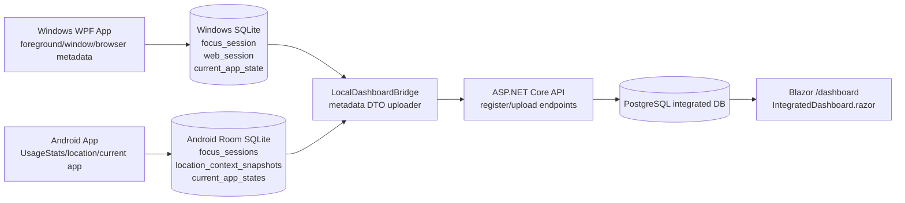
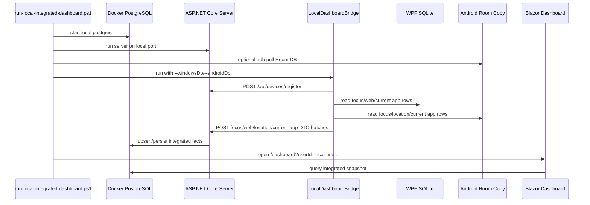
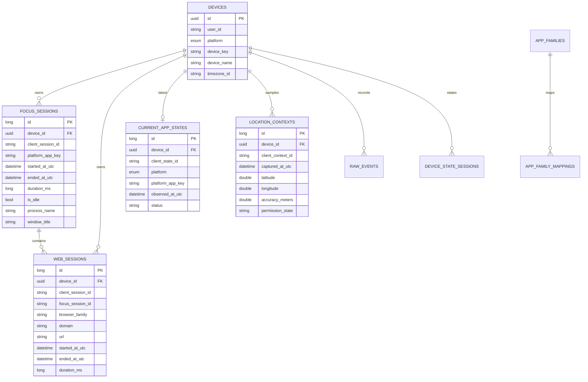
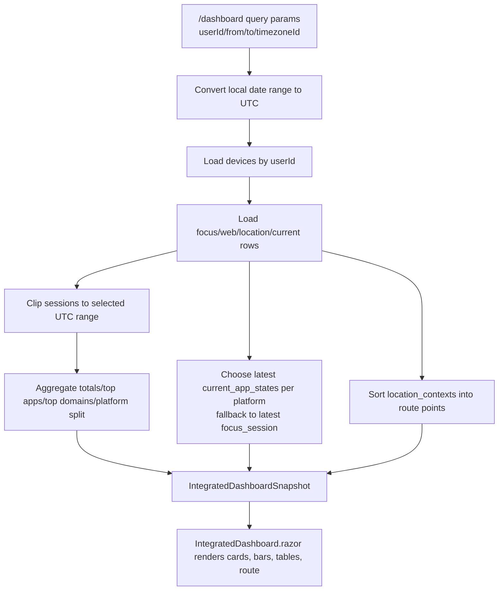
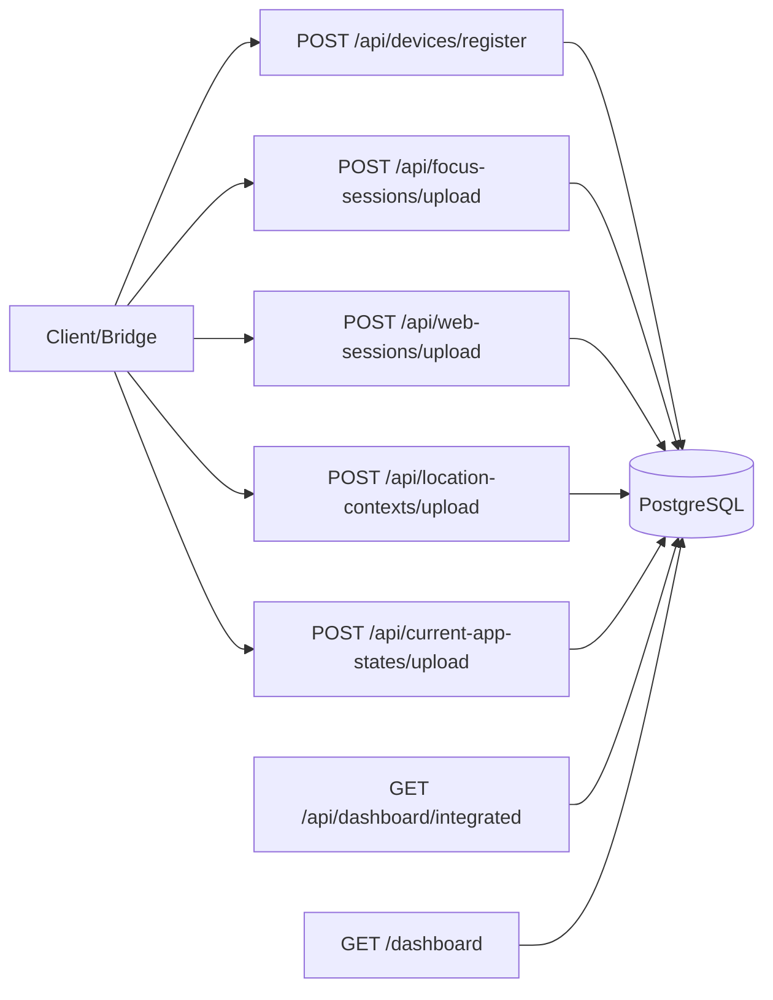

# Blazor Integrated Dashboard Feature Map

This document explains the Blazor/server dashboard layer the same way as the
Windows and Android feature maps. It focuses on what exists in code today, how
WPF/Android data reaches PostgreSQL, and how the Blazor page reads and displays
the integrated view.

## Product Meaning

The Blazor dashboard is the integrated local dashboard.

It does not directly scrape Windows or Android. It should display facts that
were already collected by:

- Windows WPF local SQLite
- Android emulator/device Room SQLite
- API DTO uploads into server PostgreSQL

The intended local flow is:

1. WPF records Windows focus/web/current-app metadata into its own SQLite DB.
2. Android records app-usage/current-app/location metadata into its own Room DB.
3. `LocalDashboardBridge` reads local DB copies and uploads metadata through API
   DTO contracts.
4. ASP.NET Core persists the uploaded facts into PostgreSQL.
5. Blazor `/dashboard` queries PostgreSQL and renders Windows, Android, and
   combined summaries.

Privacy rule: this layer displays usage metadata only. It must not display
typed text, messages, passwords, form input, clipboard contents, screenshots, or
browser page contents.

## Feature Map

| Feature | What It Does | Main Code |
| --- | --- | --- |
| Blazor route | Serves the integrated UI at `/dashboard`. | `src/Woong.MonitorStack.Server/Components/Pages/IntegratedDashboard.razor:1` |
| Polling controls | Lets the user choose dashboard refresh interval: off, 1s, 5s, 10s, 1h. Uses meta refresh. | `src/Woong.MonitorStack.Server/Components/Pages/IntegratedDashboard.razor:26`, `src/Woong.MonitorStack.Server/Components/Pages/IntegratedDashboard.razor:742` |
| Combined summary | Shows total active focus, idle, web focus, and device count across platforms. | `src/Woong.MonitorStack.Server/Components/Pages/IntegratedDashboard.razor:46` |
| Current app cards | Shows latest synced Windows current app and latest synced Android current app. | `src/Woong.MonitorStack.Server/Components/Pages/IntegratedDashboard.razor:82`, `src/Woong.MonitorStack.Server/Dashboard/IntegratedDashboardQueryService.cs:132` |
| Platform split | Shows Windows View and Android View separately with active/idle/web totals. | `src/Woong.MonitorStack.Server/Components/Pages/IntegratedDashboard.razor:107` |
| Top apps | Groups active focus sessions by app-family label and duration. | `src/Woong.MonitorStack.Server/Dashboard/IntegratedDashboardQueryService.cs:98` |
| Top domains | Groups web sessions by domain and duration. Android domains are shown only if a supported web-session source uploads them. | `src/Woong.MonitorStack.Server/Dashboard/IntegratedDashboardQueryService.cs:105` |
| Location samples | Groups opted-in Android location context samples by rounded latitude/longitude cell. | `src/Woong.MonitorStack.Server/Dashboard/IntegratedDashboardQueryService.cs:111` |
| Location route SVG | Draws an internal SVG route from stored latitude/longitude samples. No external map tiles are loaded. | `src/Woong.MonitorStack.Server/Components/Pages/IntegratedDashboard.razor:229`, `src/Woong.MonitorStack.Server/Dashboard/IntegratedDashboardQueryService.cs:142` |
| Device table | Lists registered devices and per-device active/idle/web totals. | `src/Woong.MonitorStack.Server/Components/Pages/IntegratedDashboard.razor:270` |
| Query service | Converts PostgreSQL rows into an `IntegratedDashboardSnapshot`. | `src/Woong.MonitorStack.Server/Dashboard/IntegratedDashboardQueryService.cs:8` |
| Server API endpoints | Accept device registration and metadata uploads. | `src/Woong.MonitorStack.Server/Program.cs:65`, `src/Woong.MonitorStack.Server/Program.cs:129`, `src/Woong.MonitorStack.Server/Program.cs:146`, `src/Woong.MonitorStack.Server/Program.cs:180`, `src/Woong.MonitorStack.Server/Program.cs:197` |
| Dashboard JSON API | Returns the same integrated snapshot as JSON for script/acceptance checks. | `src/Woong.MonitorStack.Server/Program.cs:226` |
| PostgreSQL EF Core | Uses `MonitorDbContext` with Npgsql outside testing. | `src/Woong.MonitorStack.Server/Program.cs:23`, `src/Woong.MonitorStack.Server/Data/MonitorDbContext.cs:5` |
| Local bridge | Reads WPF SQLite and Android Room DB copies, then uploads via API DTOs. | `tools/Woong.MonitorStack.LocalDashboardBridge/Program.cs:28` |
| Windows bridge reader | Reads `focus_session`, `web_session`, and `current_app_state` from WPF SQLite. | `tools/Woong.MonitorStack.LocalDashboardBridge/Program.cs:711` |
| Android bridge reader | Reads `focus_sessions`, `location_context_snapshots`, and `current_app_states` from Android Room. | `tools/Woong.MonitorStack.LocalDashboardBridge/Program.cs:959` |
| Local run script | Starts PostgreSQL/server, pulls Android DB if needed, runs bridge, then opens dashboard. | `scripts/run-local-integrated-dashboard.ps1:1` |
| Docker PostgreSQL | Defines local PostgreSQL container on host port `55432`. | `docker-compose.yml:1` |

## Blazor Page Structure

`IntegratedDashboard.razor` is currently one page component. Its visible layout is:

```text
IntegratedDashboard (/dashboard)
 ├─ Hero
 │   ├─ title/date/timezone
 │   └─ PostgreSQL / Metadata-only badges
 ├─ Polling Panel
 │   └─ Off / 1s / 5s / 10s / 1h
 ├─ Combined View
 │   ├─ Active Focus
 │   ├─ Idle
 │   ├─ Web Focus
 │   ├─ Devices
 │   └─ Windows current app / Android current app
 ├─ Platform Usage Split
 │   ├─ Windows View
 │   │   ├─ top apps
 │   │   └─ top domains
 │   └─ Android View
 │       ├─ top apps
 │       └─ top domains if uploaded
 ├─ Dashboard Grid
 │   ├─ Platform Totals
 │   ├─ Top Apps
 │   ├─ Top Domains
 │   └─ Location Samples
 ├─ Location Movement Route
 │   ├─ local SVG route
 │   └─ location sample list
 └─ Devices Table
```

The page receives these query parameters:

| Parameter | Meaning | Default |
| --- | --- | --- |
| `userId` | Integrated user key. | `local-user` |
| `from` | Start local date, ISO `yyyy-MM-dd`. | today UTC date |
| `to` | End local date, ISO `yyyy-MM-dd`. | same as `from` |
| `timezoneId` | Display/date boundary timezone. | `UTC` |
| `polling` | Refresh interval: `off`, `1s`, `5s`, `10s`, `1h`. | `off` |

## Data Flow



Important distinction:

- The bridge reads local DB copies.
- The server API writes PostgreSQL.
- The Blazor page reads PostgreSQL.
- Blazor should not directly attach to WPF SQLite or Android Room as its main
  source, because PostgreSQL is the only integrated DB.

## Bridge Upload Flow



## PostgreSQL Tables

The server tables are configured in `MonitorDbContext`.

| Table | Purpose | Key Rules |
| --- | --- | --- |
| `devices` | Registered Windows/Android devices owned by a user. | Unique `(UserId, Platform, DeviceKey)` |
| `focus_sessions` | Historical foreground app/window sessions. | Unique `(DeviceId, ClientSessionId)` |
| `web_sessions` | Browser domain sessions linked to a focus session. | Unique `(DeviceId, ClientSessionId)`, FK to `(DeviceId, FocusSession.ClientSessionId)` |
| `current_app_states` | Latest known current app per device. | Unique `DeviceId`; this is a latest-state table, not history |
| `location_contexts` | Opt-in location samples uploaded from Android. | Unique `(DeviceId, ClientContextId)` |
| `raw_events` | Debug/raw event facts. | Unique `(DeviceId, ClientEventId)` |
| `device_state_sessions` | Device active/idle/locked/etc. state sessions. | Unique `(DeviceId, ClientSessionId)` |
| `daily_summaries` | Precomputed daily summary rows. | Unique `(UserId, SummaryDate, TimezoneId)` |
| `app_families` | Cross-platform app family names. | Unique `Key` |
| `app_family_mappings` | Process/package/domain mapping to app family. | Unique `(MappingType, MatchKey)` |

## PostgreSQL ER Diagram



## Table Relationships In Plain Korean

- `devices`는 중심 테이블이다. Windows PC 한 대, Android 에뮬레이터/폰 한 대가 각각 한 행이다.
- `focus_sessions`는 “언제 어떤 앱이 foreground였는지”의 과거 기록이다. 한 기기는 focus session을 여러 개 가진다.
- `web_sessions`는 브라우저 안에서 domain이 잡힌 기록이다. Windows Chrome의 `chatgpt.com 15분` 같은 것이 여기에 들어간다. 가능한 경우 `focus_session_id`로 어떤 브라우저 foreground session 안에서 발생했는지 연결한다.
- `current_app_states`는 과거 기록이 아니라 “기기별 최신 상태”다. 그래서 한 device에 최대 한 행만 유지한다. Blazor의 Windows current app / Android current app 카드가 이 테이블을 우선 본다.
- `location_contexts`는 사용자가 Android 위치 컨텍스트를 켠 경우의 샘플이다. 시간에 따라 여러 행이 쌓이고 Blazor가 그 점들을 SVG route로 그린다.
- `daily_summaries`는 나중에 빠른 조회를 위한 집계 결과다. 현재 `/dashboard`는 주로 원본 fact 테이블에서 range 조회/집계를 한다.

## Query/Aggregation Logic

`IntegratedDashboardQueryService.GetAsync` does the main dashboard projection:

1. Resolve `from`/`to` local dates into UTC range using `timezoneId`.
2. Load devices for `userId`.
3. Load focus sessions, web sessions, location contexts, and current app states
   for those devices.
4. Clip session durations to the selected range.
5. Compute:
   - total active focus = non-idle focus duration
   - total idle = idle focus duration
   - total web focus = web session duration
   - platform totals
   - top apps
   - top domains
   - top location cells
   - current app per platform
   - location route points



## Current App vs Focus Session

These two are related but not the same:

- `current_app_states`: latest known app state per device. It answers “right now,
  what does the last sync say this device is focused on?”
- `focus_sessions`: historical closed/finished intervals. It answers “during the
  selected range, what apps accumulated focus time?”

Blazor current-app cards prefer `current_app_states`. If no current state exists
for a device, the query service falls back to the latest focus session in the
selected range.

## Location Route

Android stores opt-in location samples in Room as `location_context_snapshots`.
The bridge uploads them to server `location_contexts`. The Blazor dashboard then:

- filters samples to the selected range,
- ignores rows with no latitude/longitude,
- groups rounded coordinates for the “Location Samples” card,
- sorts samples by `CapturedAtUtc`,
- draws an SVG route from latitude/longitude bounds.

This is currently an internal SVG route, not Google Maps. It intentionally does
not load external map tiles.

## Server API Surface



Device upload endpoints require the `X-Device-Token` header after registration.
This keeps sync explicit and tied to registered devices.

## Tests And Acceptance Evidence

Representative test areas:

| Area | Tests |
| --- | --- |
| Blazor page/wireflow | `tests/Woong.MonitorStack.Architecture.Tests/IntegratedDashboardBlazorWireflowTests.cs` |
| Local runbook/script | `tests/Woong.MonitorStack.Architecture.Tests/LocalIntegratedDashboardRunbookTests.cs` |
| Integrated dashboard endpoint | `tests/Woong.MonitorStack.Server.Tests/Dashboard/IntegratedDashboardEndpointTests.cs` |
| Current app upload | `tests/Woong.MonitorStack.Server.Tests/CurrentApps/CurrentAppStateUploadApiTests.cs` |
| Location upload | `tests/Woong.MonitorStack.Server.Tests/Locations/LocationContextUploadApiTests.cs` |
| Local bridge readers/polling | `tests/Woong.MonitorStack.LocalDashboardBridge.Tests/LocalDashboardBridgeReaderTests.cs`, `tests/Woong.MonitorStack.LocalDashboardBridge.Tests/LocalDashboardBridgePollingTests.cs` |
| Docker PostgreSQL dev environment | `tests/Woong.MonitorStack.Architecture.Tests/ServerDockerPostgresDevEnvironmentTests.cs` |

Useful local commands:

```powershell
dotnet test Woong.MonitorStack.sln --no-restore -maxcpucount:1 -v minimal
powershell -ExecutionPolicy Bypass -File scripts\run-local-integrated-dashboard.ps1
```

For polling bridge upload:

```powershell
powershell -ExecutionPolicy Bypass -File scripts\run-local-integrated-dashboard.ps1 `
  -BridgeIntervalSeconds 5 `
  -BridgeMaxIterations 12 `
  -RefreshAndroidDbEachBridgeIteration
```

## Current Gaps / Next Refactor Targets

- `IntegratedDashboard.razor` is large and should later be split into reusable
  components such as `DashboardHero`, `PollingPanel`, `CurrentAppCards`,
  `PlatformUsagePanel`, `LocationRoutePanel`, and `DeviceTable`.
- Location route is SVG-only. If a real map is desired, choose an explicit map
  provider strategy and document network/privacy behavior.
- Android web-domain sessions are not inferred from `UsageStatsManager`. The UI
  should keep explaining that Android app usage and Windows web sessions are
  different capabilities.
- `IntegratedDashboardQueryService` currently loads rows then filters some
  ranges in memory. For larger datasets, move more filtering/grouping into SQL
  projections.
- Current app cards depend on bridge/current-state uploads being fresh. If the
  bridge is not polling, Blazor can only show the last uploaded state.
