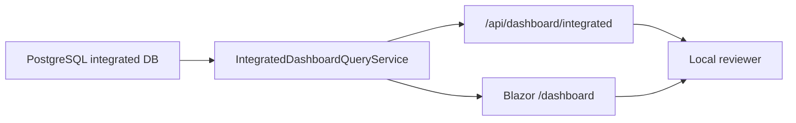

# Blazor Integrated Dashboard Local Review

This guide covers local review for the first integrated C# Blazor dashboard.
The dashboard is server-owned: it reads PostgreSQL through
`IntegratedDashboardQueryService` and renders the SSR page at `/dashboard`.
It must not read Windows SQLite, Android Room, local files, browser UI, Android
screens, screenshots, clipboard data, typed text, or page contents.

## Scope

Review these surfaces together:

| Surface | Route | Purpose |
| --- | --- | --- |
| JSON snapshot | `/api/dashboard/integrated?userId=local-user&from=2026-04-30&to=2026-04-30&timezoneId=UTC` | Machine-readable integrated dashboard payload |
| Blazor page | `/dashboard?userId=local-user&from=2026-04-30&to=2026-04-30&timezoneId=UTC` | Human-readable integrated dashboard shell |

The current page renders from `src/Woong.MonitorStack.Server/Components/Pages/IntegratedDashboard.razor`.
The query model is documented in `docs/data/integrated-data-structure.md`.

## Local Review Steps

1. Start the server with a configured PostgreSQL database and migrations applied.
2. Seed or sync metadata for at least one Windows device and one Android device
   owned by the same test user.
3. Open the JSON route first and confirm the payload is scoped to the requested
   `userId`, `from`, `to`, and `timezoneId`.
4. Open the Blazor page route with the same query parameters.
5. Compare the page totals with the JSON payload before taking visual evidence.

Use a synthetic test user and synthetic metadata for review. Do not use browser
screenshots, other-app screenshots, private page titles, typed input, clipboard
contents, message contents, or production personal data as evidence.

## Expected Page Sections

The first dashboard shell should expose:

- Header: `Integrated Device Dashboard`, date range, timezone, and PostgreSQL
  integrated-view status.
- Summary cards: Active Focus, Idle, Web Focus, and Devices.
- Platform Totals: Windows and Android active duration bars when both platforms
  have data.
- Top Apps: app-family labels aggregated across platforms.
- Top Domains: browser domain metadata only.
- Location Samples: empty safe state when no opted-in location metadata exists,
  or coarse/rounded opted-in sample labels.
- Devices table: platform, device name, timezone, active, idle, and web totals.
- Error state: invalid ISO date or unsupported timezone should show a clear
  page error or API `400` error without exposing internals.

## Privacy Review Checklist

Pass local review only when all of these remain true:

- The dashboard reads PostgreSQL facts, not Windows SQLite or Android Room.
- Sync remains opt-in at the clients; the dashboard only shows data already
  uploaded through the server API contracts.
- Device tokens and registration secrets are never displayed.
- Top domains show domain metadata, not full browser paths unless a separate
  privacy-reviewed full-URL feature is explicitly enabled.
- Location data is absent by default and only appears as opted-in coarse
  metadata.
- The UI does not display typed text, passwords, messages, form fields,
  clipboard contents, screen captures, page contents, Android touch
  coordinates, or other-app UI captures.
- Review screenshots, when added, must capture only Woong Monitor Stack pages.

## Data Flow

## Future Screenshot And Playwright Acceptance Plan

Do not automate screenshots until the dashboard contract settles. The first
acceptance slice should add Playwright or equivalent browser evidence that:

- Uses a synthetic PostgreSQL fixture or isolated test database.
- Opens `/api/dashboard/integrated` and verifies totals for Windows, Android,
  apps, domains, location empty/coarse state, and devices.
- Opens `/dashboard` and captures only the dashboard page.
- Stores artifacts under a clearly named local evidence path such as
  `artifacts/blazor-dashboard-local/latest/`.
- Includes desktop and narrow viewport screenshots.
- Fails if forbidden privacy strings such as device tokens, full private URLs,
  clipboard, typed text, screenshots, or page contents appear in the HTML.

## Notes For Reviewers

- `from` and `to` are ISO dates in `yyyy-MM-dd` format.
- `timezoneId` accepts `UTC`, `Etc/UTC`, platform-supported timezone IDs, and
  `Asia/Seoul` through the current compatibility path.
- The dashboard currently queries current PostgreSQL facts directly. Future
  acceleration may read server-side daily summaries, but the privacy boundary is
  the same: integrated data comes from server facts, not local device databases.
