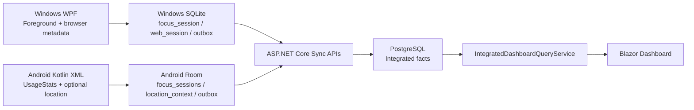
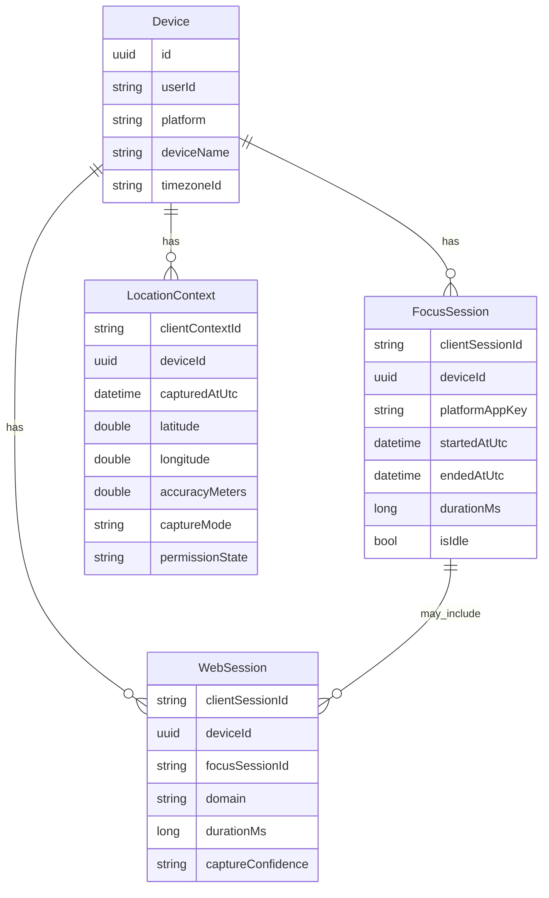

# Blazor Integrated Dashboard Wireflow

This document defines the server dashboard that combines Windows WPF and
Android usage metadata after both clients sync through API DTOs into
PostgreSQL.

## Product Goal

The Blazor dashboard must let the user answer three questions without mixing
device-local concepts:

1. What did Windows measure?
2. What did Android measure?
3. What is the combined daily picture across both devices?

Windows SQLite and Android Room remain local-only. PostgreSQL is the only
integrated database, and Blazor reads from PostgreSQL through server query
services.

## Source Flow

## Required Dashboard Views

### Combined View

Shows totals aggregated across all synced devices:

- Active Focus
- Idle
- Web Focus
- Registered devices
- Top apps across Windows and Android
- Top domains across devices when domain metadata exists

### Windows View

Shows Windows data separately:

- Windows active/idle totals
- Windows top apps from foreground `focus_sessions`
- Windows top domains from `web_sessions`
- Windows devices and timezone metadata

Windows can provide browser-domain sessions through the Chrome extension/native
messaging path or another approved browser metadata source. Window titles and
full URLs remain privacy-controlled metadata, not page content.

### Android View

Shows Android data separately:

- Android active/idle totals from UsageStats-derived app sessions
- Android top apps by package/app family
- Android top domains only if a future explicit source syncs approved web
  metadata
- Android location route when location context is enabled

Android Chrome per-domain switching is not inferred from UsageStats. The
dashboard must not pretend Android UsageStats can produce reliable Chrome tab
WebSessions.

### Location Movement Route

The dashboard renders opted-in latitude/longitude samples as a local SVG route:

- Points are ordered by captured UTC time.
- The line is rendered from persisted location metadata.
- No external map tile provider is loaded in the initial implementation.
- Accuracy, capture mode, and permission state are displayed beside route
  points.

Future map tiles can be added only if privacy, offline behavior, and provider
terms are documented.

## Data Model Expectations

## Current Implementation

- `IntegratedDashboardQueryService` returns combined totals, platform totals,
  platform-specific top apps/domains, top location cells, and ordered location
  route points.
- `/dashboard` renders Combined View, Windows View, Android View, integrated
  rankings, location SVG route, and device table.
- Data inventory diagrams live under:
  - `docs/data/wpf-dashboard-data-inventory.md`
  - `docs/data/android-dashboard-data-inventory.md`
  - `artifacts/data-diagrams/wpf-dashboard-data-inventory.svg`
  - `artifacts/data-diagrams/android-dashboard-data-inventory.svg`

## Privacy Boundary

This dashboard displays synced metadata only. It must not display or collect
typed text, passwords, messages, form input, clipboard content, screen captures,
page contents, or Android global touch coordinates.
