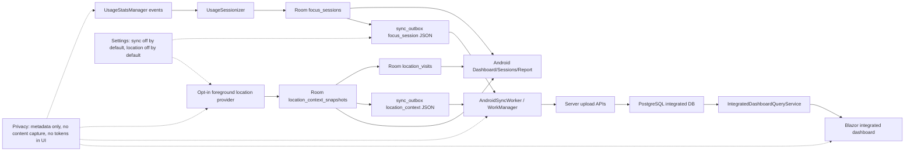

# Android Dashboard Data Inventory

This inventory documents the Android data categories that the integrated
Blazor/PostgreSQL dashboard must understand. Android remains a local
metadata-only client: Room stores Android device data, WorkManager uploads only
approved DTOs, and PostgreSQL is the only database used for Windows + Android
integration.

## Source Areas Inspected

- `android/app/src/main/java/com/woong/monitorstack/data/local`
- `android/app/src/main/java/com/woong/monitorstack/usage`
- `android/app/src/main/java/com/woong/monitorstack/dashboard`
- `android/app/src/main/java/com/woong/monitorstack/sessions`
- `android/app/src/main/java/com/woong/monitorstack/summary`
- `android/app/src/main/java/com/woong/monitorstack/location`
- `android/app/src/main/java/com/woong/monitorstack/settings`
- `android/app/src/main/java/com/woong/monitorstack/sync`
- Android unit, Robolectric, connected, snapshot, and app-switch QA tests under
  `android/app/src/test` and `android/app/src/androidTest`
- `docs/data/android-data-structure.md`
- `android_check_todo.md`

## Summary

Android contributes these dashboard categories:

| Category | Android source | Integrated dashboard meaning |
| --- | --- | --- |
| App focus sessions | `UsageStatsManager` events -> `focus_sessions` | Android foreground app duration by package, date, timezone, active/idle state, and source |
| Current/latest focus | recent Room focus rows plus `DashboardCurrentFocusResolver` | Latest meaningful Android app state for local review; integrated dashboard should present recent Android activity without pretending it is live foreground truth |
| Recent sessions and app detail | `RoomSessionsRepository` over `focus_sessions` | Android session rows, selected-package totals, selected-package hourly usage |
| Dashboard summaries/charts | `RoomDashboardRepository` over `focus_sessions` | active total, idle total, top app, hourly activity, app usage, daily activity |
| Reports | `RoomReportRepository` over `focus_sessions` | 7d/30d/90d/custom active totals, daily trend, top apps |
| Location context snapshots | opt-in provider -> `location_context_snapshots` | optional foreground location context with nullable coordinates, permission state, capture mode, local date, timezone |
| Location visits | `LocationVisitRecorder` -> `location_visits` | local aggregate of approved coordinate snapshots into rounded visit cells, duration, sample count, map points |
| Sync/outbox delivery | `sync_outbox`, `AndroidSyncWorker`, `AndroidOutboxSyncProcessor` | operational upload path for focus/session and location context facts; not an analytics fact itself |
| Settings and permissions | SharedPreferences settings, Usage Access, location permission, sync registration | dashboard eligibility/status context; tokens and secrets must never be displayed |
| Emulator evidence | snapshot and app-switch QA androidTests/scripts | local evidence that Android Room rows, outbox rows, and Woong-only screenshots exist without capturing other apps |

## Room Database

`MonitorDatabase` is `woong-monitor.db`, version 4.

| Table | Entity | Purpose | Important columns |
| --- | --- | --- | --- |
| `focus_sessions` | `FocusSessionEntity` | Derived app foreground sessions from Android usage events. | `clientSessionId` primary key, `packageName`, `startedAtUtcMillis`, `endedAtUtcMillis`, `durationMs`, `localDate`, `timezoneId`, `isIdle`, `source` |
| `sync_outbox` | `SyncOutboxEntity` | Retryable local delivery queue. | `clientItemId` primary key, `aggregateType`, `payloadJson`, `status`, `retryCount`, `lastError`, `createdAtUtcMillis`, `updatedAtUtcMillis` |
| `location_context_snapshots` | `LocationContextSnapshotEntity` | Optional foreground location context snapshots. | `id` primary key, `deviceId`, `capturedAtUtcMillis`, nullable `latitude`, nullable `longitude`, nullable `accuracyMeters`, `permissionState`, `captureMode`, `createdAtUtcMillis` |
| `location_visits` | `LocationVisitEntity` | Local aggregate of nearby approved coordinate snapshots. | `id`, `deviceId`, `locationKey`, rounded `latitude`, rounded `longitude`, `coordinatePrecisionDecimals`, `firstCapturedAtUtcMillis`, `lastCapturedAtUtcMillis`, `durationMs`, `sampleCount`, nullable `accuracyMeters`, `permissionState`, `captureMode`, timestamps |

Important DAO behavior:

- `FocusSessionDao.queryByLocalDateRange()` returns rows by inclusive local
  date and orders by `startedAtUtcMillis`.
- `FocusSessionDao.queryRecent()` and `queryByPackage()` support Sessions and
  App Detail.
- `SyncOutboxDao.queryPending()` returns `Pending` and `Failed` rows, ordered
  by creation time.
- `SyncOutboxDao.insert()` uses `IGNORE`, so a synced outbox row is not reset
  by duplicate enqueue.
- `LocationVisitDao` merges nearby location cells by `(deviceId, locationKey)`
  and time, then queries visit intervals by UTC overlap.

## UsageStats Sessions

Android usage collection follows this path:

1. `UsageStatsCollector` reads Android `UsageEvents`.
2. `UsageSessionizer` converts `ACTIVITY_RESUMED` and `ACTIVITY_PAUSED` events
   into `UsageAppSession` intervals.
3. The sessionizer sorts events, ignores configured noisy package names, clamps
   sessions to the collection window, closes an open foreground span at the
   collection end, and merges same-app sessions separated by a small gap.
4. `AndroidUsageCollectionRunner` maps sessions to `FocusSessionEntity` rows:
   `clientSessionId = android:{package}:{start}:{end}`,
   `packageName = platformAppKey`, UTC start/end millis, `durationMs`,
   `localDate`, `timezoneId`, `isIdle = false`, and
   `source = android_usage_stats`.
5. `RoomUsageSessionStore` inserts the rows.
6. `FocusSessionSyncOutboxEnqueuer` serializes each row into a
   `focus_session` outbox item.

Integrated dashboard mapping:

- PostgreSQL `focus_sessions.platform` should be Android.
- `packageName` maps to server `platformAppKey`.
- App-family normalization should happen server-side from the package key
  (`com.android.chrome` -> Chrome, etc.).
- UTC instants remain persisted as UTC; display timezone conversion happens at
  the presentation boundary.
- Android does not collect browser URLs, page titles, typed text, clipboard
  data, screenshots, or touch coordinates for this fact.

## Current And Latest Focus Behavior

Local Dashboard current-focus behavior is not a true always-on foreground feed
while Woong Monitor is open. It is derived from recent Room rows:

- `RoomDashboardRepository` returns recent focus rows for the selected period.
- `DashboardCurrentFocusResolver` ignores known launcher/SystemUI noise.
- The resolver distinguishes the selected current/recent session from the
  latest external session when Woong Monitor itself is foreground after return.
- If only noisy foreground rows exist, UI can show a safe no-app/no-package
  state rather than stale Chrome or launcher state.

Integrated dashboard implication:

- Show Android "latest activity" or "recent Android focus" from PostgreSQL
  facts, but do not label it as guaranteed live foreground unless a future
  server contract proves live device state.
- Keep `last collection time`, package, app label, and duration visible for
  review when available.

## Dashboard, Sessions, App Detail, And Reports

The integrated dashboard should expose Android data that is already visible in
local Android analytical screens:

| Local surface | Repository/model | Data to expose in integrated dashboard |
| --- | --- | --- |
| Dashboard | `RoomDashboardRepository`, `DashboardSnapshot` | active total, idle total, top app, recent sessions, hourly activity, app usage, daily activity, optional location context |
| Sessions | `RoomSessionsRepository`, `SessionRow` | app label, package, duration, local time range, active/idle state |
| App Detail | `AppDetailState` | selected package, app label, total duration, session count, hourly usage, selected-package session rows |
| Report | `RoomReportRepository`, `ReportSnapshot` | 7d/30d/90d/custom total active, day count, date range, daily activity, top apps |

Chart and report fields:

- `DashboardActivityBucket.hourOfDay` and `durationMs`
- `DashboardUsageSlice.label` and `durationMs`
- `DashboardDailyActivityBucket.localDate` and `durationMs`
- `ReportDailyActivity.localDate` and `durationMs`
- `ReportTopApp.appName` and `durationMs`

The integrated Blazor dashboard can recompute these from PostgreSQL
`focus_sessions`, but acceptance should compare the same categories so Android
and server views tell the same story.

## Location Context And Visits

Android location is opt-in, permission-gated, and nullable by design.

Collection path:

1. `SharedPreferencesAndroidLocationSettings` defaults location capture off.
2. `RuntimeLocationContextProvider` returns no snapshot unless location capture
   is enabled, foreground location permission is granted, and a last-known
   location exists.
3. Precise coordinates are stored only when precise storage is enabled and
   precise permission is granted; otherwise `latitude`, `longitude`, and
   `accuracyMeters` remain null.
4. `LocationContextCollectionRunner` inserts a
   `location_context_snapshots` row, records a local visit when coordinates
   exist, and enqueues a `location_context` outbox item.
5. `LocationVisitRecorder` rounds coordinates to four decimals by default and
   merges samples within a 30-minute gap into one visit.

Integrated dashboard mapping:

- `location_context_snapshots` can map to PostgreSQL `location_contexts` only
  for opted-in Android devices.
- Nullable coordinates must stay nullable.
- Expose permission state, capture mode, source, UTC capture time, local date,
  timezone, and optional accuracy.
- `location_visits` is local derived data today. Prefer deriving server visit
  summaries from synced location contexts, or add an explicit future upload
  DTO before treating Android visits as server facts.
- Blazor should show a safe empty state when no opted-in location metadata
  exists.

## Sync And Outbox

Focus session upload DTO:

```kotlin
SyncFocusSessionUploadRequest(
    deviceId: String,
    sessions: List<SyncFocusSessionUploadItem>
)

SyncFocusSessionUploadItem(
    clientSessionId: String,
    platformAppKey: String,
    startedAtUtc: String,
    endedAtUtc: String,
    durationMs: Long,
    localDate: String,
    timezoneId: String,
    isIdle: Boolean,
    source: String
)
```

Location context upload DTO:

```kotlin
SyncLocationContextUploadRequest(
    deviceId: String,
    contexts: List<SyncLocationContextUploadItem>
)

SyncLocationContextUploadItem(
    clientContextId: String,
    capturedAtUtc: String,
    localDate: String,
    timezoneId: String,
    latitude: Double?,
    longitude: Double?,
    accuracyMeters: Float?,
    captureMode: String,
    permissionState: String,
    source: String
)
```

Operational sync behavior:

- Sync is off by default and opt-in.
- Manual sync while sync is off remains local-only and does not enqueue a
  worker.
- Worker sync requires `KEY_BASE_URL`, `KEY_DEVICE_ID`, and a persisted device
  token.
- Uploads send the token only as `X-Device-Token`.
- `AndroidOutboxSyncProcessor` uploads focus sessions and, only when location
  capture remains enabled, location contexts.
- Server `Accepted` and `Duplicate` results mark rows `Synced`; `Error` or
  missing results mark rows `Failed`.
- 401/403 responses become auth-required repair status. Local data and pending
  outbox rows remain safe.

Integrated dashboard implication:

- Use synced PostgreSQL facts for analytics.
- Do not display `sync_outbox.payloadJson`, device tokens, registration
  secrets, or raw auth status as dashboard content.
- A future admin/review page may show aggregate sync health counts, but only
  without payload contents or secrets.

## Permissions, Privacy, And Settings

Android settings that shape dashboard eligibility:

| Setting/permission | Default | Dashboard relevance |
| --- | --- | --- |
| Usage Access permission | OS-controlled, may be missing | Without it, app usage collection cannot produce focus sessions |
| Usage collection enabled | `true` | If off, collection scheduler cancels periodic/immediate work |
| Sync enabled | `false` | If off, Android data remains local and will not appear in PostgreSQL/Blazor |
| Server URL/device ID | blank unless configured/registered | Required for sync worker upload |
| Device token | secure token store, not ordinary settings | Required for upload auth; must never be displayed |
| Location capture enabled | `false` | Location metadata remains absent by default |
| Precise latitude/longitude | `false` unless location capture enabled | Coordinates remain null unless explicit precise opt-in and permission exist |

Privacy requirements:

- Do not collect or integrate typed text, passwords, messages, form contents,
  clipboard contents, browser page contents, page text, full browsing URLs,
  global touch coordinates, screen recordings, periodic screenshots, or
  other-app UI contents.
- Android `AndroidSyncPayloadPrivacyTest` guards focus and location payloads
  against forbidden URL/path/title/typed/clipboard/screenshot/touch fields.
- Screenshots are local evidence only and must show Woong Monitor UI, not
  Chrome or other apps.

## Emulator Evidence And Remaining Gaps

Current evidence categories in Android tests/checklist:

- Seven canonical Woong UI screenshots:
  `artifacts/android-ui-snapshots/latest/figma-01-splash.png` through
  `figma-07-settings.png`.
- Expanded dashboard/sessions/report/settings screenshots, including recent
  sessions, app detail, custom report valid/invalid, and scrolled settings.
- App-switch QA evidence under `artifacts/android-app-switch-qa/...` with
  `room-assertions.json`.
- UsageStats current-focus validation under
  `artifacts/android-usage-current-focus/...`.
- Resource/performance-style evidence under
  `artifacts/android-resource-measurements/...`.

Evidence gaps for integrated dashboard acceptance:

- No single Blazor/PostgreSQL acceptance artifact yet proves Android
  `focus_sessions` uploaded from Room appear beside Windows data in the Blazor
  dashboard.
- Local `location_visits` are not yet a server upload contract; integrated
  dashboard should derive visit-like summaries from PostgreSQL location context
  rows or wait for an explicit visit DTO.
- Current/latest focus evidence is local/emulator-oriented. Integrated Blazor
  should present it as latest collected Android activity unless live foreground
  state is later uploaded by an explicit privacy-reviewed contract.
- Sync health/status is tested locally but should remain operational metadata,
  not dashboard analytics content.

## PostgreSQL Mapping Checklist

| Android data | PostgreSQL/integrated target | Notes |
| --- | --- | --- |
| `focus_sessions` | server `focus_sessions` | Android platform, `deviceId`, `clientSessionId`, `platformAppKey = packageName`, UTC start/end, duration, local date, timezone, `isIdle`, source |
| package display names | server app family/mapping or presentation layer | Store package key as identity; app label is display data |
| dashboard hourly/app/daily charts | computed from server `focus_sessions` | Recompute in Blazor/query service rather than importing Android UI models |
| recent sessions/app detail | computed from server `focus_sessions` | Keep selected-package rows and totals available |
| report periods | computed from server `focus_sessions` | 7d/30d/90d/custom active totals and daily buckets |
| `location_context_snapshots` | server `location_contexts` | Opt-in only; keep nullable coordinates, permission state, capture mode, source |
| `location_visits` | future server-derived summary or future explicit DTO | Do not silently import local derived rows without a contract |
| `sync_outbox` | no analytics table | Operational delivery queue only |
| sync registration/token | server `devices` plus auth/token infrastructure | Never expose device token in dashboard |

## Mermaid Data Flow


