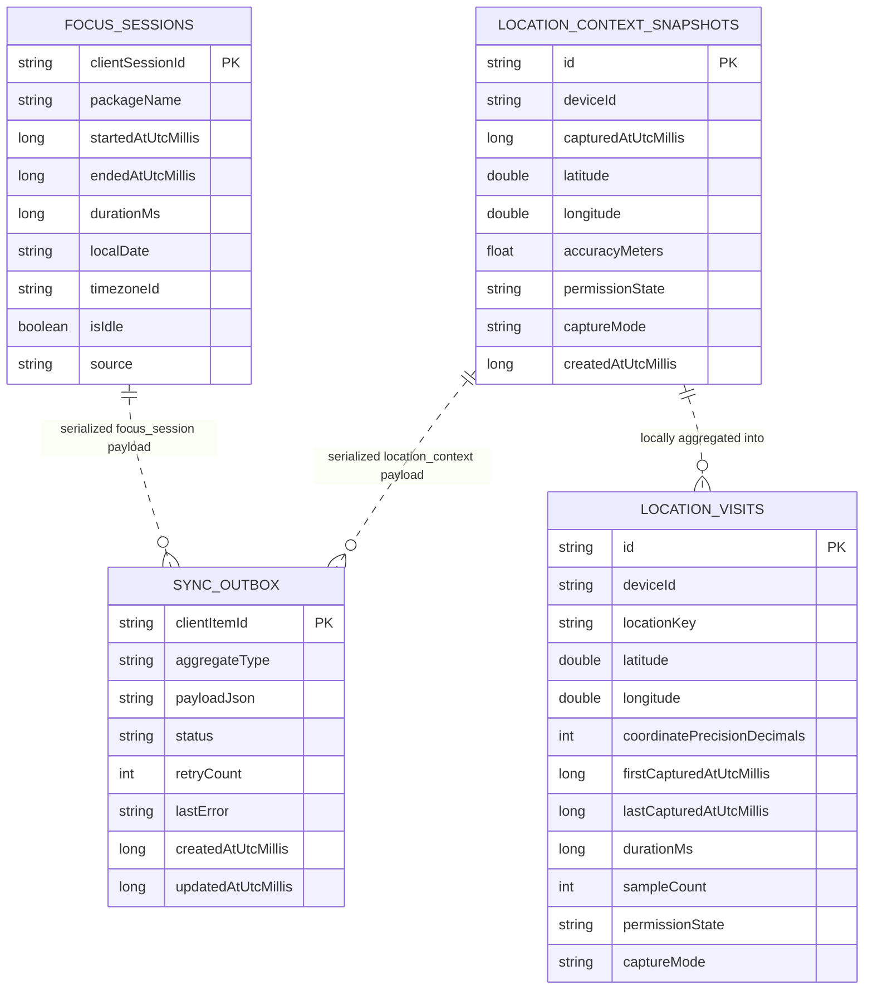
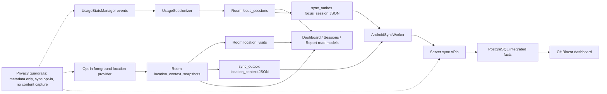

# Android Data Structure

## Summary

Android stores local usage metadata in the Room database `woong-monitor.db`
(`MonitorDatabase`, version 4). The local model is centered on app focus
sessions from `UsageStatsManager`, an operational sync outbox, optional
foreground location context snapshots, and local location visit summaries.

The integrated Blazor/PostgreSQL dashboard should treat Android as a client
that contributes metadata through server sync APIs. Android Room tables are not
shared directly with Windows or PostgreSQL, and `sync_outbox` is an Android
delivery mechanism rather than an analytical table.

## Source Files Inspected

- `android/app/src/main/java/com/woong/monitorstack/data/local/MonitorDatabase.kt`
- `android/app/src/main/java/com/woong/monitorstack/data/local/*Entity.kt`
- `android/app/src/main/java/com/woong/monitorstack/data/local/*Dao.kt`
- `android/app/src/main/java/com/woong/monitorstack/usage/AndroidUsageCollectionRunner.kt`
- `android/app/src/main/java/com/woong/monitorstack/usage/FocusSessionSyncOutboxEnqueuer.kt`
- `android/app/src/main/java/com/woong/monitorstack/sync/*.kt`
- `android/app/src/main/java/com/woong/monitorstack/location/*.kt`
- `android/app/src/main/java/com/woong/monitorstack/dashboard/RoomDashboardRepository.kt`
- `android/app/src/main/java/com/woong/monitorstack/sessions/RoomSessionsRepository.kt`
- `android/app/src/main/java/com/woong/monitorstack/summary/RoomReportRepository.kt`

## Room Tables

| Table | Entity | Purpose | Important columns |
| --- | --- | --- | --- |
| `focus_sessions` | `FocusSessionEntity` | App foreground sessions derived from Android usage events. | `clientSessionId` primary key, `packageName`, `startedAtUtcMillis`, `endedAtUtcMillis`, `durationMs`, `localDate`, `timezoneId`, `isIdle`, `source` |
| `sync_outbox` | `SyncOutboxEntity` | Local retryable upload queue for server sync. | `clientItemId` primary key, `aggregateType`, `payloadJson`, `status`, `retryCount`, `lastError`, `createdAtUtcMillis`, `updatedAtUtcMillis` |
| `location_context_snapshots` | `LocationContextSnapshotEntity` | Optional location context captured only when settings and foreground permission allow it. | `id` primary key, `deviceId`, `capturedAtUtcMillis`, nullable `latitude`, nullable `longitude`, nullable `accuracyMeters`, `permissionState`, `captureMode`, `createdAtUtcMillis` |
| `location_visits` | `LocationVisitEntity` | Local aggregate of nearby opted-in location snapshots for dashboard summaries. | `id` primary key, `deviceId`, `locationKey`, rounded `latitude`, rounded `longitude`, `coordinatePrecisionDecimals`, `firstCapturedAtUtcMillis`, `lastCapturedAtUtcMillis`, `durationMs`, `sampleCount`, nullable `accuracyMeters`, `permissionState`, `captureMode`, timestamps |

`location_visits` has indexes on `(deviceId, locationKey,
lastCapturedAtUtcMillis)` and `(deviceId, firstCapturedAtUtcMillis,
lastCapturedAtUtcMillis)`. The code does not define foreign keys between
domain tables and `sync_outbox`; outbox rows reference domain records through
`clientItemId` and serialized JSON payloads.

## Local Read Models

- Dashboard reads `focus_sessions` by local date range, clips durations to the
  requested UTC window, filters idle sessions for active totals, groups app
  usage by display app name, and returns recent rows, hourly buckets, daily
  buckets, and optional location context.
- Sessions reads recent focus sessions or range-filtered focus sessions and
  formats app detail rows from `focus_sessions`.
- Report reads `focus_sessions` by local date range, excludes idle rows, and
  builds daily activity plus top-app totals.
- Location context on the dashboard comes from the latest
  `location_context_snapshots` row in range plus `location_visits` summary rows.

## Sync And Outbox Payload Path

Usage collection:

1. `AndroidUsageCollectionRunner` reads Android usage events through
   `UsageStatsCollector`.
2. `UsageSessionizer` converts resumed/paused app events into sessions.
3. Sessions are stored in `focus_sessions` with `source =
   android_usage_stats`.
4. `FocusSessionSyncOutboxEnqueuer` inserts `sync_outbox` rows with
   `aggregateType = focus_session` and JSON `SyncFocusSessionUploadItem`.
5. `AndroidSyncWorker` runs only when sync is enabled and configured.
6. `AndroidOutboxSyncProcessor` uploads pending focus sessions through
   `AndroidSyncClient.uploadFocusSessions()` to
   `/api/focus-sessions/upload`.

Location context:

1. `RuntimeLocationContextProvider` returns no snapshot unless location capture
   is enabled, foreground location permission exists, and a runtime location is
   available.
2. Precise latitude/longitude are stored only when precise storage is enabled
   and precise permission is granted; otherwise coordinates remain null.
3. `LocationContextCollectionRunner` inserts `location_context_snapshots`,
   updates local `location_visits`, and enqueues `aggregateType =
   location_context`.
4. `AndroidOutboxSyncProcessor` uploads location context rows only when
   location capture remains enabled, through
   `/api/location-contexts/upload`.

Outbox upload results mark rows `Synced` for accepted/duplicate server results
or `Failed` for rejected/missing item results. Failed rows remain queryable for
retry. HTTP 401/403 upload failures are classified as Android sync
authentication failures so the app can require register/repair without deleting
local pending data.

## Sync DTOs

```kotlin
SyncFocusSessionUploadRequest(
    deviceId: String,
    sessions: List<SyncFocusSessionUploadItem>
)

SyncFocusSessionUploadItem(
    clientSessionId: String,
    platformAppKey: String,
    startedAtUtc: String,
    endedAtUtc: String,
    durationMs: Long,
    localDate: String,
    timezoneId: String,
    isIdle: Boolean,
    source: String
)

SyncLocationContextUploadRequest(
    deviceId: String,
    contexts: List<SyncLocationContextUploadItem>
)

SyncLocationContextUploadItem(
    clientContextId: String,
    capturedAtUtc: String,
    localDate: String,
    timezoneId: String,
    latitude: Double?,
    longitude: Double?,
    accuracyMeters: Float?,
    captureMode: String,
    permissionState: String,
    source: String
)
```

Device registration uses `/api/devices/register` with `userId`, `platform`,
`deviceKey`, `deviceName`, and `timezoneId`, returning `deviceId` and
`deviceToken`. Uploads send `X-Device-Token` when a token is present.

## Privacy Boundaries

Android data is metadata-only. The integrated dashboard must not infer or add
collection of typed text, passwords, messages, form input, clipboard contents,
browser page contents, page text, full browsing URLs, global touch coordinates,
screen recordings, periodic screenshots, or other-app UI contents.

Location context is opt-in and permission-gated. Nullable Android location
fields are intentional and must remain nullable in integration paths. Sync is
opt-in/off by default, and token/device registration state is operational
security data, not product analytics content.

## PostgreSQL Mapping Notes

- `focus_sessions` should map into the integrated PostgreSQL focus/session fact
  table with `platform = Android`, server `deviceId`, `clientSessionId`,
  `platformAppKey = packageName`, UTC start/end instants, duration, local date,
  timezone, idle flag, and source.
- Android package names should map to the shared app identity model through
  `platformAppKey`; display names are presentation values and should not be the
  database key.
- `sync_outbox` should not be imported into analytical PostgreSQL tables. If
  sync health is needed, represent it as separate operational telemetry without
  payload contents or tokens.
- `location_context_snapshots` can map to a server location context table only
  for opted-in users/devices. Keep coordinates nullable and retain
  `permissionState`, `captureMode`, source, local date, and timezone.
- `location_visits` is currently a local derived aggregate. Prefer deriving
  PostgreSQL visit summaries from synced location contexts, or add an explicit
  future upload contract before integrating visits as server facts.
- Device registration data should map to server device/user identity tables;
  device tokens must remain secret and must not be exposed in Blazor dashboard
  views.

## Mermaid ER Diagram



## Mermaid Data Flow


