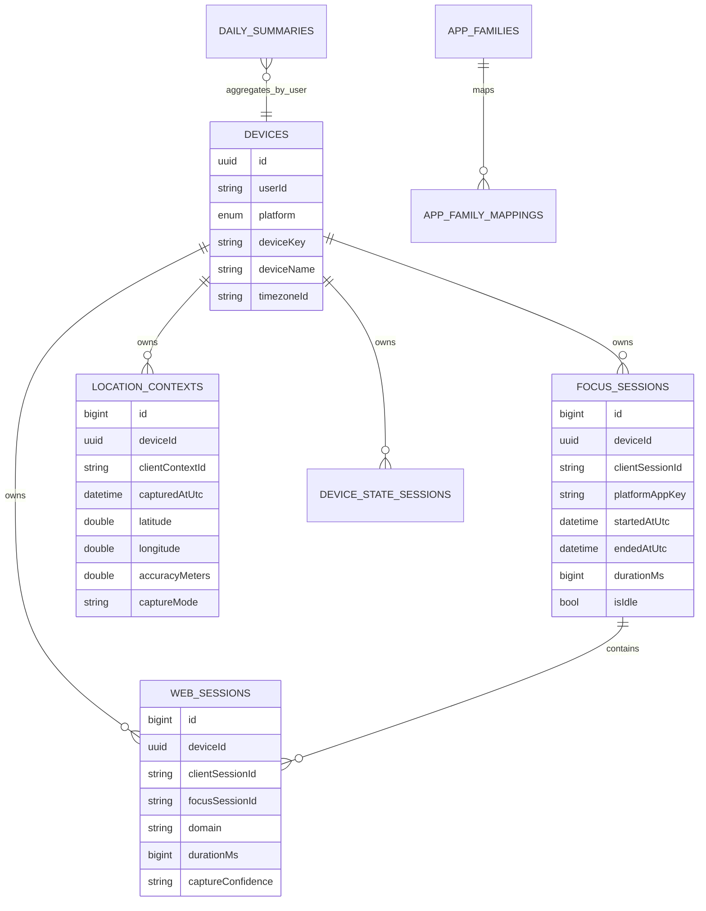
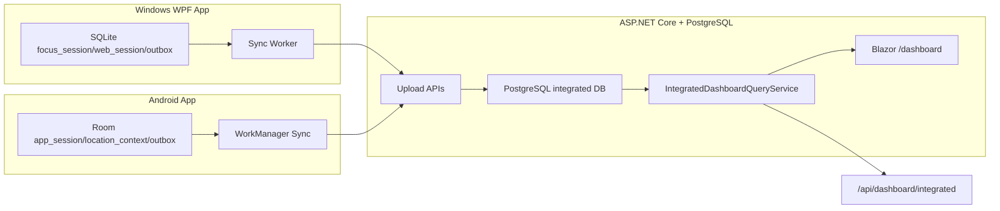

# Integrated Windows + Android Dashboard Data Structure

This document defines the first server-side integrated dashboard model for
Woong Monitor Stack. It is intentionally server-owned: Windows SQLite and
Android Room remain device-local, while PostgreSQL is the only integrated data
store.

## Purpose

The Blazor dashboard answers one question:

> Across my Windows PC and Android phone, how much active focus time did I spend
> by platform, app family, browser domain, and opted-in location context?

The dashboard reads PostgreSQL through `IntegratedDashboardQueryService`. It
does not read Windows SQLite, Android Room, filesystem logs, Chrome UI, Android
screens, clipboard contents, typed text, or screenshots.

## Current Server Tables Used

| Table | Source | Purpose |
| --- | --- | --- |
| `devices` | Windows/Android registration API | User-owned device inventory |
| `focus_sessions` | Windows WPF sync, Android UsageStats sync | Foreground app/window/app-package intervals |
| `web_sessions` | Windows browser extension/native messaging, Android future/deferred web metadata | Browser domain intervals linked to focus sessions |
| `location_contexts` | Android opt-in foreground location context | Coarse location metadata snapshots |
| `daily_summaries` | Server aggregation job | Precomputed daily totals for future dashboard acceleration |
| `app_families` / `app_family_mappings` | Server mapping policy | Cross-platform app normalization |

## Dashboard DTO

`IntegratedDashboardSnapshot`

| Field | Meaning |
| --- | --- |
| `userId` | Requested owner/user id |
| `fromDate`, `toDate` | Inclusive local-date range |
| `timezoneId` | Display/query timezone |
| `totalActiveMs` | Non-idle `focus_sessions` duration |
| `totalIdleMs` | Idle `focus_sessions` duration |
| `totalWebMs` | `web_sessions` duration |
| `devices` | Per-device Windows/Android totals |
| `platformTotals` | Windows vs Android active/idle/web totals |
| `topApps` | App-family totals using `AppFamilyMapper` |
| `topDomains` | Domain totals from `web_sessions.domain` |
| `topLocations` | Coarse rounded location sample groups |

## API And Blazor Routes

| Route | Type | Purpose |
| --- | --- | --- |
| `/api/dashboard/integrated?userId=...&from=yyyy-MM-dd&to=yyyy-MM-dd&timezoneId=...` | JSON API | Machine-readable integrated dashboard snapshot |
| `/dashboard?userId=...&from=yyyy-MM-dd&to=yyyy-MM-dd&timezoneId=...` | Blazor SSR page | Human-readable dashboard shell |

## Mermaid ER Diagram

## Mermaid Data Flow

## Privacy Rules

- Integrate metadata only: app/window/site/location timing, not content.
- Do not integrate typed text, passwords, clipboard contents, form fields,
  Android touch coordinates, page contents, screen recordings, or user activity
  screenshots.
- Location data must stay opt-in and should be grouped/coarsened for statistics.
- Full URL remains opt-in; domain-only browser storage is the default safe path.

## Current Implementation Notes

- First implementation reads current PostgreSQL facts directly and aggregates
  in `IntegratedDashboardQueryService`.
- `web_sessions` are filtered by UTC date for this first slice. Future work can
  reuse the local-date splitter from `DailySummaryQueryService` for exact
  timezone-aware cross-midnight web totals.
- `location_contexts` are grouped by rounded coordinate label for dashboard
  review. Android local `location_visits` is still device-local unless uploaded
  through a future explicit DTO.

## Next Work

- Add PostgreSQL migration/table support for server-side `location_visits` if
  Android visit intervals should sync separately from raw location contexts.
- Add authenticated user/session provider before public dashboard use.
- Add dashboard filters for Today/1h/6h/24h/custom date range.
- Harden production dashboard ownership/authentication before public exposure.
- Add richer Blazor filters for Today/1h/6h/24h/custom ranges once product UX
  decisions are finalized.
