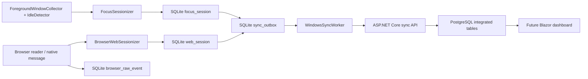
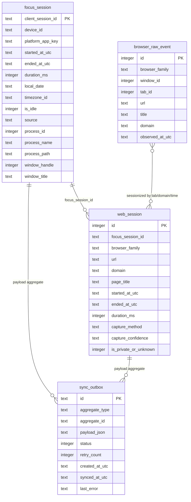

# Windows Data Structure

This note maps the Windows/WPF local data structures that feed the current
desktop dashboard and future integrated C# Blazor dashboard. Windows remains a
local-first client: it writes only its own device data to SQLite, queues sync
payloads in a local outbox, and integrates with Android only through the server
API and PostgreSQL.

## Summary

- Runtime collection starts with foreground-window metadata: process, PID,
  HWND, optional process path, optional window title, timestamp, and idle state.
- Closed foreground intervals become `focus_session` rows.
- Browser metadata can become `web_session` rows when a browser domain is
  available. The default WPF pipeline uses domain-only storage.
- Chrome/native-message input can also write short-retention
  `browser_raw_event` rows before sessionization.
- Every persisted focus/web session queues a `sync_outbox` payload. Sync is
  opt-in; local dashboard reads do not require server upload.
- Presentation reads `focus_session` and `web_session` through
  `SqliteDashboardDataSource` and maps them into summary cards, charts, app
  session rows, web session rows, and runtime event rows.

## SQLite Tables

### `focus_session`

Source: `SqliteFocusSessionRepository`.

| Column | Type | Notes |
| --- | --- | --- |
| `client_session_id` | `TEXT PRIMARY KEY` | Client idempotency key. Maps to server `ClientSessionId`. |
| `device_id` | `TEXT NOT NULL` | Windows device id used in upload DTOs. |
| `platform_app_key` | `TEXT NOT NULL` | Windows process/app key, often `chrome.exe`, `Code.exe`, etc. |
| `started_at_utc` / `ended_at_utc` | `TEXT NOT NULL` | UTC ISO instants. |
| `duration_ms` | `INTEGER NOT NULL` | Duration for the foreground interval. |
| `local_date` | `TEXT NOT NULL` | Derived from start time and `timezone_id`. |
| `timezone_id` | `TEXT NOT NULL` | Device/user display timezone. |
| `is_idle` | `INTEGER NOT NULL` | `1` for idle intervals, otherwise active. |
| `source` | `TEXT NOT NULL` | Usually `foreground_window`. |
| `process_id` | `INTEGER NULL` | Windows PID metadata. |
| `process_name` | `TEXT NULL` | Process name metadata. |
| `process_path` | `TEXT NULL` | Executable path metadata. |
| `window_handle` | `INTEGER NULL` | HWND metadata. |
| `window_title` | `TEXT NULL` | Cleared before default persistence/sync unless explicitly allowed. |

Important index: `ix_focus_session_started_at_utc`.

### `web_session`

Source: `SqliteWebSessionRepository`.

| Column | Type | Notes |
| --- | --- | --- |
| `id` | `INTEGER PRIMARY KEY AUTOINCREMENT` | Local row id only. |
| `focus_session_id` | `TEXT NOT NULL` | Links to the local focus session id. |
| `browser_family` | `TEXT NOT NULL` | Browser family such as Chrome or Edge. |
| `url` | `TEXT NULL` | Null in domain-only privacy mode. |
| `domain` | `TEXT NOT NULL` | Required normalized registrable domain. |
| `page_title` | `TEXT NULL` | Null in domain-only privacy mode. |
| `started_at_utc` / `ended_at_utc` | `TEXT NOT NULL` | UTC ISO instants. |
| `duration_ms` | `INTEGER NOT NULL` | Browser/domain interval duration. |
| `capture_method` | `TEXT NULL` | Examples: `UIAutomationAddressBar`, `BrowserExtensionFuture`. |
| `capture_confidence` | `TEXT NULL` | Examples: `Medium`, `High`. |
| `is_private_or_unknown` | `INTEGER NULL` | Optional privacy/provenance marker. |

Important index: `ix_web_session_focus_session_id`.

### `browser_raw_event`

Source: `SqliteBrowserRawEventRepository`.

This table is browser-capture source evidence, not the primary dashboard fact
table. It has a retention policy and should not be treated as durable integrated
analytics.

| Column | Type | Notes |
| --- | --- | --- |
| `id` | `INTEGER PRIMARY KEY AUTOINCREMENT` | Local row id only. |
| `browser_family` | `TEXT NOT NULL` | Browser family. |
| `window_id` | `INTEGER NOT NULL` | Browser window id from extension/native message. |
| `tab_id` | `INTEGER NOT NULL` | Browser tab id from extension/native message. |
| `url` | `TEXT NULL` | May be null after sanitization or when privacy mode removes it. |
| `title` | `TEXT NULL` | May be null after sanitization or when privacy mode removes it. |
| `domain` | `TEXT NULL` | Domain extracted from browser event. |
| `observed_at_utc` | `TEXT NOT NULL` | UTC ISO observation time. |

Important index: `ix_browser_raw_event_tab_time`.

### `sync_outbox`

Source: `SqliteSyncOutboxRepository`.

| Column | Type | Notes |
| --- | --- | --- |
| `id` | `TEXT PRIMARY KEY` | Local deterministic outbox id, e.g. `focus-session:{clientSessionId}`. |
| `aggregate_type` | `TEXT NOT NULL` | `focus_session`, `web_session`, or future supported aggregate. |
| `aggregate_id` | `TEXT NOT NULL` | Client upload id used for idempotency. |
| `payload_json` | `TEXT NOT NULL` | Serialized server upload request DTO. |
| `status` | `INTEGER NOT NULL` | `Pending`, `Synced`, or `Failed`. |
| `retry_count` | `INTEGER NOT NULL` | Incremented after failed upload attempts. |
| `created_at_utc` | `TEXT NOT NULL` | UTC enqueue time. |
| `synced_at_utc` | `TEXT NULL` | UTC successful sync time. |
| `last_error` | `TEXT NULL` | Last upload failure summary. |

Important index: `ix_sync_outbox_status`.

## Sync And Upload Path

Focus-session persistence:

1. `WindowsTrackingDashboardCoordinator` receives a closed `FocusSession`.
2. `WindowsFocusSessionPersistenceService` clears `windowTitle` before default
   persistence/sync.
3. `SqliteFocusSessionRepository.Save` inserts into `focus_session`.
4. A `sync_outbox` row is inserted with `aggregate_type = focus_session` and an
   `UploadFocusSessionsRequest` payload.
5. `HttpWindowsSyncApiClient` posts it to `/api/focus-sessions/upload` with
   `X-Device-Token`.

Web-session persistence:

1. `IBrowserActivityReader` or Chrome native-message ingestion produces browser
   metadata.
2. `BrowserUrlSanitizer` applies the configured storage policy. WPF default is
   `DomainOnly`.
3. `BrowserWebSessionizer` closes web intervals when domain/tab identity
   changes or the focus session ends.
4. `WindowsWebSessionPersistenceService` inserts `web_session` and outbox
   payloads using `UploadWebSessionsRequest`.
5. `HttpWindowsSyncApiClient` posts it to `/api/web-sessions/upload`.

## Dashboard Data Source Models

- `IDashboardDataSource` exposes `QueryFocusSessions(startedAtUtc, endedAtUtc)`
  and `QueryWebSessions(startedAtUtc, endedAtUtc)`.
- `SqliteDashboardDataSource` reads the local SQLite repositories and orders web
  sessions by start time.
- `DashboardViewModel` converts domain models into:
  `DashboardSummaryCard`, `DashboardSessionRow`, `DashboardWebSessionRow`,
  `DashboardEventLogRow`, `DashboardChartPoint`, and `DashboardLiveChartsData`.
- `DashboardChartMapper` aggregates hourly activity, top apps, and top domains.
  Detail charts aggregate duplicate labels before sorting/display.

## ER View

## Privacy Notes

Do not integrate or design dashboard features around data the product must not
collect:

- No keystroke contents, passwords, messages, form input, or clipboard data.
- No screenshots, screen recordings, or page contents as telemetry.
- No hidden/covert tracking; collection must stay visible to the user.
- No direct cross-reading of Android Room or Windows SQLite. PostgreSQL is the
  only integrated store.
- Window titles and browser page titles may expose private context. The default
  Windows persistence path clears `windowTitle`, and the default browser storage
  path clears full `url` and `page_title`.
- `browser_raw_event` may be more sensitive than derived domain totals. Treat it
  as local short-retention troubleshooting/source evidence, not the primary
  integrated analytics model.
- Server sync remains opt-in. A Blazor dashboard should read only data that has
  arrived through explicit client sync and server-side device/user ownership.

## Mapping To Integrated PostgreSQL

The future Blazor dashboard should read server/PostgreSQL facts, not local
SQLite. Windows local rows map through upload DTOs:

| Windows SQLite/source | Upload DTO | Server/PostgreSQL target | Mapping notes |
| --- | --- | --- | --- |
| `focus_session` | `UploadFocusSessionsRequest.Sessions[]` | `focus_sessions` | `client_session_id` becomes idempotency key with `deviceId`; app/process metadata remains Windows-specific nullable metadata. |
| `web_session` | `UploadWebSessionsRequest.Sessions[]` | `web_sessions` | Outbox aggregate id becomes web `clientSessionId`; `focus_session_id` links to the parent focus session using device + focus id; `domain` is required, `url`/`pageTitle` nullable. |
| `browser_raw_event` | future/raw upload only when explicitly wired | `raw_events` | Do not use as durable dashboard input unless a privacy-reviewed raw-event upload contract is enabled. |
| `sync_outbox` | local transport queue | none | Outbox rows are client implementation details and should not be modeled as integrated analytics facts. |
| dashboard rows/charts | derived locally from focus/web sessions | server `daily_summaries` and range statistics | Recompute or query server summaries from PostgreSQL; do not import WPF presentation row models directly. |

Integration design guidance:

- Use server `devices` to scope Windows rows by authenticated user/device.
- Keep `(deviceId, clientSessionId)` idempotency for focus and web sessions.
- Use `app_family_mappings` to group Windows `platform_app_key` values with
  Android package names, e.g. `chrome.exe` and `com.android.chrome`.
- Build Blazor app/domain/time charts from `focus_sessions`, `web_sessions`,
  and server summaries, not from `sync_outbox.payload_json`.
- Keep all stored instants UTC and convert to the selected user timezone only
  in query/presentation boundaries.
