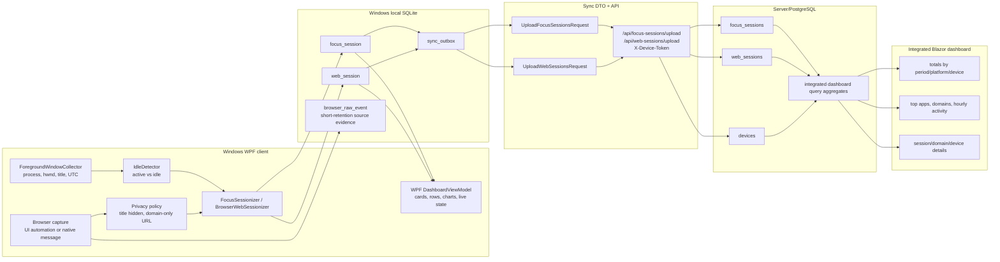

# WPF Dashboard Data Inventory

This inventory describes the Windows/WPF data categories that the integrated
Blazor dashboard must expose from Windows. It is based on the current Windows
tracking, SQLite storage, sync, WPF dashboard, and related tests under:

- `src/Woong.MonitorStack.Windows`
- `src/Woong.MonitorStack.Windows.App`
- `src/Woong.MonitorStack.Windows.Presentation`
- `tests/Woong.MonitorStack.Windows.Tests`
- `tests/Woong.MonitorStack.Windows.App.Tests`
- `tests/Woong.MonitorStack.Windows.Presentation.Tests`

The Windows client remains a local-first metadata collector. It writes local
SQLite data and queues sync DTO payloads; the integrated Blazor dashboard must
read integrated data only from the server/PostgreSQL side after client sync.

## Summary

Windows currently contributes these dashboard data categories:

- Device identity: `deviceId`, platform, device name/key, timezone, registration
  state, and device-token transport metadata. Tokens are operational secrets and
  must not appear in dashboard analytics.
- Current foreground/runtime state: live app/process/window metadata, current
  session duration, current browser domain, browser capture status, last poll
  time, last DB write time, runtime errors, and tracking/sync/privacy badges.
  This is WPF-local live UI state today; the integrated dashboard should treat it
  as historical only unless a future real-time server channel is added.
- Focus sessions: closed foreground intervals grouped by app/process identity,
  active/idle state, UTC range, local date, timezone, source, and optional
  Windows process/window metadata.
- Web sessions: browser-domain intervals linked to a focus session, browser
  family, UTC range, duration, capture method/confidence, and private/unknown
  flag. Domain-only storage is the default.
- Browser raw events: Chrome/native-message source events with short local
  retention. These are source evidence and troubleshooting data, not primary
  integrated dashboard analytics.
- Sync outbox/status: pending, failed, and synced local transport rows for focus
  and web session upload payloads. This can support sync-health UI but should not
  be treated as usage telemetry.
- Privacy/settings: collection visibility, window-title visibility, page-title
  and full-URL capture disabled by default, domain-only browser storage, sync
  opt-in, sync endpoint text, local database path/status, runtime log path/status,
  and explicit local-data deletion.
- DB lifecycle: local SQLite file under `%LOCALAPPDATA%\WoongMonitorStack` by
  default, optional env override, create/load/delete UI, repository initialization,
  and additive schema guards.
- WPF dashboard fields: summary cards, current focus panel, recent app sessions,
  recent web sessions, live event rows, top app/domain chart points, and chart
  details.

## Local SQLite Tables

### `focus_session`

Created by `SqliteFocusSessionRepository.Initialize()` and populated by
`WindowsFocusSessionPersistenceService`.

| Column | Type | Dashboard meaning |
| --- | --- | --- |
| `client_session_id` | TEXT PK | Stable Windows client id for idempotency and sync |
| `device_id` | TEXT | Local/server device id |
| `platform_app_key` | TEXT | App grouping key, currently usually process name such as `chrome.exe` |
| `started_at_utc` | TEXT | UTC start instant |
| `ended_at_utc` | TEXT | UTC end instant |
| `duration_ms` | INTEGER | Session duration |
| `local_date` | TEXT | Local date derived from start time and timezone |
| `timezone_id` | TEXT | Display timezone used when session was created |
| `is_idle` | INTEGER | Active/idle classification |
| `source` | TEXT | Source such as `foreground_window` or acceptance fake source |
| `process_id` | INTEGER NULL | Windows process id |
| `process_name` | TEXT NULL | Process name |
| `process_path` | TEXT NULL | Executable path |
| `window_handle` | INTEGER NULL | HWND |
| `window_title` | TEXT NULL | Sensitive; default persistence clears it |

Index: `ix_focus_session_started_at_utc`.

Integrated mapping: upload through `UploadFocusSessionsRequest.Sessions[]` to
server/PostgreSQL `focus_sessions`, keyed by `(deviceId, clientSessionId)`.
Integrated dashboard fields should aggregate `duration_ms` into total active,
idle, platform totals, top apps, device totals, hourly charts, and app-session
detail rows. Window title must remain absent unless a future explicit policy
allows it end-to-end.

### `web_session`

Created by `SqliteWebSessionRepository.Initialize()` and populated by
`WindowsWebSessionPersistenceService`.

| Column | Type | Dashboard meaning |
| --- | --- | --- |
| `id` | INTEGER PK | Local row id only |
| `focus_session_id` | TEXT | Parent focus-session client id |
| `browser_family` | TEXT | Browser family such as `Chrome` |
| `url` | TEXT NULL | Sensitive; null under default domain-only storage |
| `domain` | TEXT | Registrable domain for integrated web analytics |
| `page_title` | TEXT NULL | Sensitive; null under default policy |
| `started_at_utc` | TEXT | UTC start instant |
| `ended_at_utc` | TEXT | UTC end instant |
| `duration_ms` | INTEGER | Web-domain duration |
| `capture_method` | TEXT NULL | Source method, e.g. UI automation fallback or extension |
| `capture_confidence` | TEXT NULL | Confidence such as `High` |
| `is_private_or_unknown` | INTEGER NULL | Browser private/unknown indicator |

Index: `ix_web_session_focus_session_id`.

Integrated mapping: upload through `UploadWebSessionsRequest.Sessions[]` to
server/PostgreSQL `web_sessions`, keyed by generated client web-session id and
linked to `focus_session_id`. Integrated dashboard fields should aggregate web
duration by domain, browser family, device, platform, and local-date range.

### `browser_raw_event`

Created by `SqliteBrowserRawEventRepository.Initialize()` and used by
Chrome/native-message ingestion.

| Column | Type | Dashboard meaning |
| --- | --- | --- |
| `id` | INTEGER PK | Local row id only |
| `browser_family` | TEXT | Browser source |
| `window_id` | INTEGER | Browser window id |
| `tab_id` | INTEGER | Browser tab id |
| `url` | TEXT NULL | Potentially sensitive raw source value |
| `title` | TEXT NULL | Potentially sensitive raw source value |
| `domain` | TEXT NULL | Domain extracted from event |
| `observed_at_utc` | TEXT | UTC event time |

Index: `ix_browser_raw_event_tab_time`.

Retention: `BrowserRawEventRetentionPolicy.Default` is 30 days. Raw events are
local source evidence for deriving web sessions and diagnosing capture. They
should not be exposed in the integrated dashboard unless a future explicit raw
event product surface is designed with strict privacy review.

### `sync_outbox`

Created by `SqliteSyncOutboxRepository.Initialize()` and populated by Windows
focus/web persistence services.

| Column | Type | Dashboard meaning |
| --- | --- | --- |
| `id` | TEXT PK | Local outbox id, e.g. `focus-session:{id}` |
| `aggregate_type` | TEXT | `focus_session`, `web_session`, or supported raw-event type |
| `aggregate_id` | TEXT | Client aggregate id |
| `payload_json` | TEXT | Serialized upload DTO; may contain usage metadata |
| `status` | INTEGER | Pending, failed, or synced |
| `retry_count` | INTEGER | Failed-upload retry count |
| `created_at_utc` | TEXT | UTC queued time |
| `synced_at_utc` | TEXT NULL | UTC successful sync time |
| `last_error` | TEXT NULL | Last sync failure message |

Index: `ix_sync_outbox_status`.

Integrated mapping: local transport queue only. If the Blazor dashboard exposes
sync health, it should use server-side device/checkpoint state or a dedicated
sync-health contract. It should not parse client `payload_json` as analytics.

## Runtime State

Runtime collection starts with `ForegroundWindowCollector`, which wraps
`IForegroundWindowReader` and `ISystemClock` and produces
`ForegroundWindowSnapshot`:

- `Hwnd`
- `ProcessId`
- `ProcessName`
- `ExecutablePath`
- `WindowTitle`
- `TimestampUtc`

`IdleDetector` classifies the foreground sample as idle or active using the
last-input reader and the configured idle threshold. `FocusSessionizer` closes
the prior session whenever the foreground identity or idle state changes, then
creates `FocusSession` values using UTC instants and a display timezone id.

`WindowsTrackingDashboardCoordinator` bridges this runtime pipeline to WPF UI
state and persistence. It emits `DashboardTrackingSnapshot`:

- `AppName`
- `ProcessName`
- `WindowTitle`
- `CurrentSessionDuration`
- `LastPersistedSession`
- `CurrentBrowserDomain`
- `BrowserCaptureStatus`
- `LastPollAtUtc`
- `LastDbWriteAtUtc`
- `HasPersistedWebSession`
- `CurrentWebSessionStartedAtUtc`
- `CurrentWebSessionDuration`

Integrated dashboard note: the current WPF runtime state is not currently synced
as a live-state table. The integrated dashboard should expose Windows history
from `focus_sessions` and `web_sessions`; live current-focus state is a future
separate contract if needed.

## Browser/Web Metadata Path

Browser metadata can come from UI automation fallback or Chrome native messaging:

- `BrowserActivitySnapshot` includes browser/process/window metadata, tab title,
  URL, domain, capture method, confidence, private/unknown state, and UTC capture
  time.
- `BrowserUrlSanitizer` defaults to `DomainOnly`, which clears full URL and tab
  title while retaining a normalized domain.
- `BrowserWebSessionizer` turns domain changes into closed `WebSession` rows.
- `WindowsWebSessionPersistenceService` applies the storage policy again before
  writing SQLite and queuing outbox payloads.

The WPF settings model shows page-title capture and full-URL capture disabled,
domain-only browser storage enabled, and sync off by default.

## Sync Payload Path

Focus session upload path:

1. `WindowsFocusSessionPersistenceService.SaveFocusSession` clears
   `windowTitle`.
2. `SqliteFocusSessionRepository.Save` writes `focus_session`.
3. A `sync_outbox` row is queued with `aggregate_type = focus_session`.
4. Payload is `UploadFocusSessionsRequest` with `FocusSessionUploadItem`.
5. `HttpWindowsSyncApiClient` posts to `/api/focus-sessions/upload` with
   `X-Device-Token`.
6. `WindowsSyncWorker` marks the outbox row synced for accepted/duplicate
   results or failed with retry metadata for rejected results.

Web session upload path:

1. `WindowsWebSessionPersistenceService.SaveWebSession` applies domain-only
   policy by default.
2. `SqliteWebSessionRepository.Save` writes `web_session`.
3. A `sync_outbox` row is queued with `aggregate_type = web_session`.
4. Payload is `UploadWebSessionsRequest` with `WebSessionUploadItem`.
5. `HttpWindowsSyncApiClient` posts to `/api/web-sessions/upload` with
   `X-Device-Token`.
6. `WindowsSyncWorker` uses the same accepted/duplicate/failed handling.

Supported HTTP client endpoint mapping also includes `/api/raw-events/upload`
for `raw_event`, but current WPF dashboard analytics should prefer derived
focus/web sessions.

## WPF Dashboard Fields

The local WPF dashboard reads SQLite through `SqliteDashboardDataSource`, which
implements:

- `QueryFocusSessions(startedAtUtc, endedAtUtc)`
- `QueryWebSessions(startedAtUtc, endedAtUtc)`

`DashboardViewModel` then derives:

- Summary cards: `Active Focus`, `Foreground`, `Idle`, `Web Focus`.
- Totals: `TotalActiveMs`, `TotalForegroundMs`, `TotalIdleMs`, `TotalWebMs`.
- Top labels: `TopAppName`, `TopDomainName`.
- Current focus panel: tracking status, current app/process/window-title text,
  browser domain, browser capture status, session duration, last poll, last DB
  write, last persisted session, last sync status.
- Recent app-session rows: app, process, local start/end time, duration, active
  or idle state, privacy-filtered window title text, source, idle flag, process
  path.
- Recent web-session rows: domain, privacy-filtered page-title text, URL mode,
  local start/end time, duration, browser, confidence.
- Live event rows: focus/web/runtime events with local time, app/domain, and
  message.
- Chart points: hourly activity, app usage, app usage details, domain usage, and
  domain usage details.

Chart behavior currently tested:

- Hourly activity is timezone-display aware and excludes idle time.
- Dashboard app/domain horizontal charts show top 3.
- Details app/domain charts keep up to 10.
- Duplicate app/domain labels are aggregated before chart output.
- Recent details tables paginate with a default 10 rows per page.

## PostgreSQL Mapping For Integrated Dashboard

The integrated dashboard should expose Windows data through server tables and
DTOs rather than direct SQLite reads:

| Windows source | Sync DTO | PostgreSQL/integrated target |
| --- | --- | --- |
| `deviceId`, timezone, platform | registration contracts | `devices` and device filters |
| `focus_session` | `UploadFocusSessionsRequest` | `focus_sessions`, app/device/platform totals, current period totals |
| `web_session` | `UploadWebSessionsRequest` | `web_sessions`, domain/browser totals |
| `sync_outbox` | local transport only | optional sync-health surface, not usage analytics |
| `browser_raw_event` | raw-event contract if explicitly enabled | source evidence only; avoid primary dashboard use |

Integrated dashboard aggregations should recompute from PostgreSQL using UTC
instants and convert to requested display timezone at query/presentation
boundaries. Local `local_date` is useful source metadata but should not override
server-side timezone/date range handling.

Windows does not provide location context. Integrated location cards/maps should
come from explicit Android opt-in location context only.

## Privacy Notes

Must not integrate or expose:

- Keystroke contents, passwords, messages, form input, clipboard contents,
  screenshots, screen recordings, page contents, or private message content.
- Device tokens or raw auth secrets.
- Full URLs, query strings, URL fragments, page titles, or window titles unless
  a future explicit opt-in policy, storage contract, and UI disclosure are
  implemented end-to-end.
- `browser_raw_event` rows as ordinary analytics.

Default safe behavior currently evidenced by tests:

- Focus persistence clears `WindowTitle` before SQLite/outbox payload.
- Web persistence clears `Url` and `PageTitle` under domain-only policy.
- Browser URL sanitizer supports domain-only storage and strips fragments for
  explicit full-URL mode.
- Sync is off by default in WPF settings; syncing is explicit opt-in.
- WPF acceptance scripts record screenshots as local developer artifacts for the
  app UI only, not product telemetry.

## DB Lifecycle And Operational Fields

Default local database path is:

`%LOCALAPPDATA%\WoongMonitorStack\windows-local.db`

The path can be overridden with `WOONG_MONITOR_LOCAL_DB`. The app also supports:

- `WOONG_MONITOR_DEVICE_ID`
- `WOONG_MONITOR_ACCEPTANCE_MODE`
- `WOONG_MONITOR_AUTO_START_TRACKING`

`WindowsLocalDatabaseController` supports create/switch, load existing, and
delete/recreate operations. It initializes focus, web, and outbox repositories
after path changes. Runtime logs default beside the database under
`logs/windows-runtime.log`.

## Mermaid Data Flow

## Acceptance Evidence Gaps

Current tests and acceptance scripts cover local WPF tracking, SQLite persistence,
domain-only web metadata, outbox queueing, chart aggregation, UI snapshot
artifacts, and privacy-boundary text. Before declaring Windows fully integrated
in the Blazor dashboard, close or explicitly accept these evidence gaps:

- End-to-end Windows seed/sync evidence into server/PostgreSQL and
  `/api/dashboard/integrated`, showing Windows focus/web sessions beside Android
  data.
- Integrated dashboard privacy assertion that Windows window titles, page
  titles, full URLs, and tokens are absent from Blazor API responses and UI.
- Sync-health policy decision: either expose server-side device/checkpoint
  health in Blazor or leave local `sync_outbox` out of integrated dashboard.
- Browser raw event policy decision: keep raw events local/source-only unless a
  separate explicit raw-event milestone is approved.
- Live current-focus policy decision: keep WPF current runtime state local, or
  design a future real-time server contract separate from historical usage
  aggregates.
- Fresh artifact pointer from WPF acceptance run to integrated-dashboard seeding
  evidence once the Blazor dashboard acceptance path is finalized.
