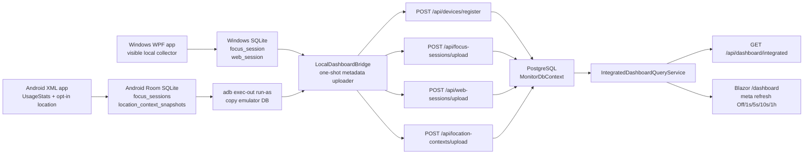

# Local Integrated Dashboard Audit

Audit date: 2026-05-03

Scope inspected:

- `src/Woong.MonitorStack.Server`
- Blazor dashboard files inside the server project
- `tools/Woong.MonitorStack.LocalDashboardBridge`
- `scripts/run-local-integrated-dashboard.ps1`
- Docker/PostgreSQL setup files
- bridge/server/dashboard tests
- related docs

No implementation files were changed for this audit.

## Bottom Line

The repo already has the main local-only bridge flow in place:

1. WPF persists local metadata to SQLite.
2. Android emulator persists local metadata to Room.
3. `LocalDashboardBridge` reads WPF SQLite and a copied Android Room SQLite file.
4. The bridge registers local devices and uploads metadata through server API DTOs.
5. The server stores integrated facts in PostgreSQL.
6. Blazor `/dashboard` renders the integrated server view and supports polling intervals.

Important nuance: Blazor polling does not read WPF SQLite or Android Room. It refreshes the server-rendered dashboard page and each render queries PostgreSQL through `IntegratedDashboardQueryService`. The only component that reads SQLite/Room is `LocalDashboardBridge`, and it is currently a one-shot uploader.

The current app cards exist, but they show latest synced/persisted focus sessions per platform, not guaranteed live in-progress foreground apps. A live "current app right now" requirement still needs an explicit current-state upload path or bridge polling/current-snapshot slice.

## Architecture

## What Exists

### Server and Blazor

- `Program.cs` configures `MonitorDbContext` with Npgsql outside the Testing environment and maps the relevant endpoints:
  - `/api/devices/register`
  - `/api/focus-sessions/upload`
  - `/api/web-sessions/upload`
  - `/api/location-contexts/upload`
  - `/api/dashboard/integrated`
- `IntegratedDashboardQueryService` reads only server database entities: `Devices`, `FocusSessions`, `WebSessions`, and `LocationContexts`.
- `Components/Pages/IntegratedDashboard.razor` is the Blazor dashboard. It injects `IntegratedDashboardQueryService` directly and uses `<meta http-equiv="refresh">` for polling.
- Current app cards are rendered from `snapshot.CurrentApps` with labels for Windows current app and Android current app.

### Local Bridge

- `LocalDashboardBridge` reads WPF SQLite tables:
  - `focus_session`
  - `web_session`
- It reads Android Room tables:
  - `focus_sessions`
  - `location_context_snapshots`
- It uploads through API DTOs rather than writing PostgreSQL directly.
- It does not read typed text, clipboard contents, page contents, screenshots, Android touch coordinates, or message/password/form content.

### Local Script and PostgreSQL

- `docker-compose.yml` defines local PostgreSQL 16 on host port `55432`.
- `.env.example` documents local-only development credentials.
- `scripts/start-server-postgres.ps1` starts PostgreSQL and applies EF migrations.
- `scripts/run-local-integrated-dashboard.ps1` starts PostgreSQL/server, pulls the Android Room DB with `adb`, runs the bridge, writes a small report, and opens `/dashboard`.

### Tests and Docs

- Bridge reader tests cover temp WPF SQLite and temp Room-like databases.
- Server dashboard query tests cover Windows + Android aggregation, platform splits, route ordering, timezone range filtering, and range clipping.
- Server endpoint/page tests cover `/api/dashboard/integrated`, `/dashboard`, and current app labels.
- Architecture tests check the Blazor dashboard structure, polling controls, Docker/PostgreSQL setup, and local runbook/script presence.
- Existing docs already state the correct boundary: Blazor reads PostgreSQL-derived facts and does not poll WPF SQLite or Android Room directly.

## Exact Gaps

### P0: Live Current App Is Not Actually Live

The Blazor cards show the latest synced focus session in PostgreSQL. They do not show an in-progress WPF foreground window or Android foreground app unless that session has already been persisted locally and uploaded.

Why this matters:

- WPF `PollOnce` persists closed sessions, while `StopTracking` persists the current session. A currently focused app can remain only in WPF memory until it closes/stops.
- Android bridge ingestion reads completed `focus_sessions` rows from Room where `durationMs > 0`.
- The dashboard labels say current app, but the implementation is "latest synced app fact".

Missing pieces:

- A server DTO/entity/API for current device state, or a defined convention for open focus-session snapshots.
- WPF bridge/client snapshot of current foreground app at bridge time.
- Android bridge/client snapshot of current foreground app at bridge time.
- Tests proving Windows current app and Android current app appear when the apps are still active, not only after completed sessions are synced.

### P0: No Continuous Local Bridge Poller

Blazor can refresh every 1s/5s/10s/1h, but it only rereads PostgreSQL. The bridge runs once. New local WPF/Android data will not appear unless:

- native client sync uploads it, or
- the user reruns `scripts/run-local-integrated-dashboard.ps1`, or
- a future bridge polling mode keeps uploading snapshots.

Missing pieces:

- `LocalDashboardBridge` continuous mode or script loop such as `-BridgeIntervalSeconds`.
- A checkpoint/range option so repeated bridge runs do not scan every row forever.
- A local report field showing last successful bridge upload time per source.
- Tests for repeated polling without duplicate inflation.

### P1: No True End-to-End Test Of WPF SQLite + Android Room Through Bridge Into Dashboard

Current tests are good but split:

- Bridge tests read temp SQLite/Room-like files only.
- Dashboard tests seed server DB directly.
- The acceptance script seeds synthetic API payloads, not local SQLite/Room through the bridge.
- Architecture tests mostly assert strings and file presence.

Missing tests:

- Create temp WPF SQLite and temp Android Room-like DBs.
- Start the server on a relational provider.
- Run the bridge CLI against the server.
- Query `/api/dashboard/integrated`.
- Assert Windows current app, Android current app, platform totals, top apps, and location data.
- Add a PostgreSQL/Testcontainers variant or a local-Docker guarded test for provider-specific confidence.

### P1: Local Script Opens Dashboard Without Verifying The Required Data Is Present

`run-local-integrated-dashboard.ps1` starts services and runs the bridge, but it does not fail or clearly warn if the integrated dashboard lacks one platform.

Missing script checks:

- After bridge upload, call `/api/dashboard/integrated`.
- Assert a Windows device/current app exists unless `-SkipWindows`.
- Assert an Android device/current app exists unless `-SkipAndroid`.
- Record accepted/duplicate/error counts from upload responses.
- Include server process id/log paths and data-presence status in the generated report.

### P1: Bridge Upload Summary Counts Attempted Items, Not Server Results

The bridge returns counts based on the input list sizes after a successful HTTP response. It does not parse `UploadBatchResult` statuses, so accepted, duplicate, and error rows are collapsed into one number.

Missing pieces:

- Parse upload response bodies.
- Report accepted/duplicate/error counts separately.
- Fail or warn when any item returns `Error`.
- Tests for duplicate reruns and missing focus-session links in the bridge CLI path.

### P2: Bridge Reads Base Tables, Not Local Outbox State

The bridge reads `focus_session`, `web_session`, `focus_sessions`, and `location_context_snapshots` directly. It does not respect local sync outbox status or local client sync settings.

This is acceptable only if the manual bridge command itself is treated as the explicit local opt-in. If product intent is "only upload rows the client marked syncable", then the bridge should read outbox/checkpoints instead.

Missing pieces if stricter opt-in is required:

- Bridge mode that uploads only pending outbox rows.
- Documentation that manual bridge execution is the opt-in boundary.
- Tests proving sync-disabled client rows are not uploaded unless explicitly requested.

### P2: Daily Summary Job Is A Service, Not A Hosted Scheduled Job

`DailySummaryAggregationService` exists, but the inspected server startup does not register a daily-summary `BackgroundService`. The Blazor integrated dashboard currently reads raw server facts, so this is not a blocker for the local dashboard. It is still a PRD-level gap if daily summaries must be generated automatically.

Missing pieces:

- Scheduled hosted service for previous-day summary generation.
- Runbook/script trigger for local summary generation if needed.
- Integration tests for automatic summary creation.

## Endpoint, Job, Script, And Test Matrix

| Area | Present | Missing |
| --- | --- | --- |
| Device registration | `/api/devices/register` | None for local dashboard |
| Focus upload | `/api/focus-sessions/upload` | Current/open focus snapshot path |
| Web upload | `/api/web-sessions/upload` | Android web-domain source is intentionally absent for now |
| Location upload | `/api/location-contexts/upload` | Optional aggregated `location_visits` upload if dashboard should show visit durations |
| Integrated dashboard API | `/api/dashboard/integrated` | Post-bridge verification in local script |
| Blazor polling | Meta refresh re-render of `/dashboard` | Browser-side API polling is not implemented; continuous bridge polling is not implemented |
| PostgreSQL local dev | Docker Compose + start/stop scripts | Script-owned cleanup/status reporting for server process |
| Jobs | Raw event retention hosted service | Daily summary hosted job, bridge polling job |
| Tests | Bridge readers, server query/page, architecture string tests, synthetic acceptance | Full bridge-to-server-to-dashboard E2E with temp SQLite/Room; live current-app behavior; bridge upload result parsing; local script data-presence verification |

## Prioritized Implementation Slices

1. Add a RED test for local bridge-to-dashboard E2E with temp WPF SQLite and temp Android Room-like databases. Make it prove `/api/dashboard/integrated` returns both Windows and Android current app entries after bridge upload.
2. Define "current app" precisely. If it must mean live foreground state, add current-state DTOs/endpoints and bridge/client readers for WPF and Android current snapshots. If latest synced session is enough, rename labels/docs to "Latest synced app".
3. Add bridge upload result parsing and reporting. Preserve idempotent reruns, but surface accepted/duplicate/error counts.
4. Add `run-local-integrated-dashboard.ps1` post-upload verification. Fail or warn when required Windows/Android data is missing, and write the evidence to the script report.
5. Add bridge continuous mode or script polling mode. Keep Blazor polling PostgreSQL-only; let the bridge poll local DB snapshots into PostgreSQL on an explicit interval.
6. Decide whether bridge reads base tables or outbox-only rows. Document the opt-in boundary and add tests for that policy.
7. Add PostgreSQL-backed dashboard endpoint coverage for the integrated dashboard path. Keep SQLite relational tests for speed, but add a guarded PostgreSQL test for provider confidence.
8. Add the daily-summary hosted job only if the next milestone needs automatic summaries. It is not required for the current Blazor page because the page queries raw integrated facts.

## Privacy Notes

The inspected flow preserves the main privacy boundary:

- Local WPF and Android databases do not read each other.
- The bridge uses API DTOs and does not write PostgreSQL directly.
- Blazor reads server facts, not local device databases.
- The dashboard displays app/package/process/domain/location metadata, not typed text, passwords, messages, form input, clipboard contents, page contents, screenshots, or Android touch coordinates.

The bridge currently supports `url` and `page_title` fields if present in WPF `web_session`; the dashboard renders domains only. Keep URL/title display behind a separate privacy-reviewed feature if ever exposed.

## Changed Paths

- `docs/local-integrated-dashboard-audit.md`
