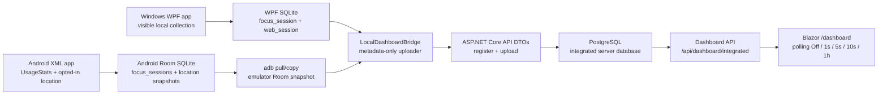

# Local Integrated Dashboard Runbook

This runbook is for the local-only workflow the project now optimizes for:

1. Use the Windows WPF app normally.
2. Use the Android emulator app normally.
3. Run one local command.
4. Open Blazor and see Windows, Android, and combined dashboard data from
   local PostgreSQL.

No cloud deployment, Play Store publishing, or public auth setup is required
for this workflow.

## What The Local Flow Does

`scripts/run-local-integrated-dashboard.ps1` starts local Docker PostgreSQL,
starts the ASP.NET Core/Blazor server, reads local client databases, uploads
metadata through the same API DTO contracts, and opens `/dashboard`.

Sources:

- WPF SQLite:
  `%LOCALAPPDATA%\WoongMonitorStack\windows-local.db`
- Android emulator Room:
  pulled with `adb` from
  `com.woong.monitorstack/databases/woong-monitor.db`
- Integrated database:
  Docker PostgreSQL at `localhost:55432`
- Display:
  Blazor `/dashboard`

The bridge is local-only developer tooling. It does not make Windows SQLite
and Android Room know about each other; it reads each local database and sends
approved metadata to the server APIs, where PostgreSQL performs integration.

## Corrected Local Dashboard Architecture



The bridge is the only local integrated dashboard ingestion step. Blazor does
not poll WPF SQLite or Android Room directly; it polls the server dashboard API,
which reads PostgreSQL-derived integrated facts. The page exposes user-selected
polling intervals of Off, 1s, 5s, 10s, and 1h.

## Run

```powershell
powershell -ExecutionPolicy Bypass -File scripts\run-local-integrated-dashboard.ps1
```

The script prints and opens a URL like:

```text
http://127.0.0.1:5087/dashboard?userId=local-user&from=YYYY-MM-DD&to=YYYY-MM-DD&timezoneId=<local timezone>
```

## If Android DB Pull Fails

Make sure:

- Android emulator is running.
- The debug app is installed.
- `adb devices` shows the emulator.
- The app has been opened at least once so Room created `woong-monitor.db`.

You can also provide a copied DB file:

```powershell
powershell -ExecutionPolicy Bypass -File scripts\run-local-integrated-dashboard.ps1 `
  -SkipAndroidPull `
  -AndroidDb D:\temp\woong-monitor.db
```

## Useful Options

```powershell
# Windows only
powershell -ExecutionPolicy Bypass -File scripts\run-local-integrated-dashboard.ps1 -SkipAndroid

# Android only
powershell -ExecutionPolicy Bypass -File scripts\run-local-integrated-dashboard.ps1 -SkipWindows

# Print commands without running
powershell -ExecutionPolicy Bypass -File scripts\run-local-integrated-dashboard.ps1 -DryRun
```

## Privacy Boundary

The local integrated dashboard shows metadata only:

- app/process/package names
- foreground/app session time ranges and durations
- domain-only web sessions when Windows browser tracking has metadata
- opted-in Android location coordinates when enabled

It does not read typed text, passwords, messages, form input, clipboard
contents, browser page contents, screen recordings, screenshots of other apps,
or Android touch coordinates.
