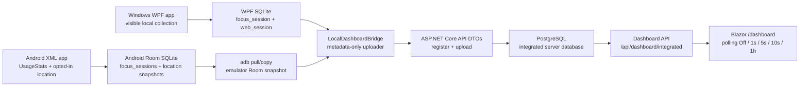

# Local Integrated Dashboard Runbook

This runbook is for the local-only workflow the project now optimizes for:

1. Use the Windows WPF app normally.
2. Use the Android emulator app normally.
3. Run one local command.
4. Open Blazor and see Windows, Android, and combined dashboard data from
   local PostgreSQL.

No cloud deployment, Play Store publishing, or public auth setup is required
for this workflow.

## What The Local Flow Does

`scripts/run-local-integrated-dashboard.ps1` starts local Docker PostgreSQL,
starts the ASP.NET Core/Blazor server, reads local client databases, uploads
metadata through the same API DTO contracts, and opens `/dashboard`.

Sources:

- WPF SQLite:
  `%LOCALAPPDATA%\WoongMonitorStack\windows-local.db`
- Android emulator Room:
  pulled with `adb` from
  `com.woong.monitorstack/databases/woong-monitor.db`
- Integrated database:
  Docker PostgreSQL at `localhost:55432`
- Display:
  Blazor `/dashboard`

The bridge is local-only developer tooling. It does not make Windows SQLite
and Android Room know about each other; it reads each local database and sends
approved metadata to the server APIs, where PostgreSQL performs integration.

## Corrected Local Dashboard Architecture



The bridge is the only local integrated dashboard ingestion step. Blazor does
not poll WPF SQLite or Android Room directly; it polls the server dashboard API,
which reads PostgreSQL-derived integrated facts. The page exposes user-selected
polling intervals of Off, 1s, 5s, 10s, and 1h. The script can also ask the
local bridge to repeat uploads so PostgreSQL keeps receiving refreshed local
metadata while Blazor polls the server.

## Run

```powershell
powershell -ExecutionPolicy Bypass -File scripts\run-local-integrated-dashboard.ps1
```

The script prints and opens a URL like:

```text
http://127.0.0.1:5087/dashboard?userId=local-user&from=YYYY-MM-DD&to=YYYY-MM-DD&timezoneId=<local timezone>
```

## If Android DB Pull Fails

Make sure:

- Android emulator is running.
- The debug app is installed.
- `adb devices` shows the emulator.
- The app has been opened at least once so Room created `woong-monitor.db`.

You can also provide a copied DB file:

```powershell
powershell -ExecutionPolicy Bypass -File scripts\run-local-integrated-dashboard.ps1 `
  -SkipAndroidPull `
  -AndroidDb D:\temp\woong-monitor.db
```

## Useful Options

```powershell
# Windows only
powershell -ExecutionPolicy Bypass -File scripts\run-local-integrated-dashboard.ps1 -SkipAndroid

# Android only
powershell -ExecutionPolicy Bypass -File scripts\run-local-integrated-dashboard.ps1 -SkipWindows

# Print commands without running
powershell -ExecutionPolicy Bypass -File scripts\run-local-integrated-dashboard.ps1 -DryRun

# Re-run bridge uploads every 5 seconds for 12 iterations
powershell -ExecutionPolicy Bypass -File scripts\run-local-integrated-dashboard.ps1 `
  -BridgeIntervalSeconds 5 `
  -BridgeMaxIterations 12

# Re-run bridge uploads every 10 seconds until stopped with Ctrl+C
powershell -ExecutionPolicy Bypass -File scripts\run-local-integrated-dashboard.ps1 `
  -BridgeIntervalSeconds 10

# Use an explicit bridge checkpoint file
powershell -ExecutionPolicy Bypass -File scripts\run-local-integrated-dashboard.ps1 `
  -BridgeIntervalSeconds 5 `
  -BridgeMaxIterations 12 `
  -BridgeCheckpointPath D:\temp\woong-bridge-checkpoints.json
```

Default bridge upload mode is one-shot. `-BridgeMaxIterations` requires
`-BridgeIntervalSeconds`; leaving max iterations unset runs the bridge
continuously in the foreground. In one-shot mode the script does not pass a
checkpoint file unless `-BridgeCheckpointPath` is provided. In interval mode,
when `-BridgeCheckpointPath` is omitted, the script passes
`<OutputRoot>\bridge-checkpoints.json` to `LocalDashboardBridge`; an explicit
`-BridgeCheckpointPath` overrides that default. The script pulls the Android
emulator Room database once before starting the bridge, so continuous mode
rereads the same configured `-AndroidDb` file unless that file is refreshed
separately.

## LocalDashboardBridge Checkpoint/Range Scanning

Repeated bridge uploads are idempotent and can avoid reattempting unchanged
rows when checkpointing is enabled on the bridge CLI. Checkpointing is an
optimization, not a privacy or correctness boundary: duplicate-safe server DTO
uploads still need to remain valid when a checkpoint file is deleted or a row is
seen twice.

Current bridge contract:

- Enable checkpointing through the script with `-BridgeCheckpointPath <path>`,
  or through direct bridge CLI usage with
  `--checkpointPath <bridge-checkpoints.json>`.
- Store bridge checkpoints as a local JSON file such as
  `bridge-checkpoints.json`.
- Track only metadata cursors such as `ended_at_utc` plus `client_session_id`
  for Windows `focus_session` and `web_session`, `endedAtUtcMillis` plus
  `clientSessionId` for Android `focus_sessions`, and `capturedAtUtcMillis`
  plus `id` for Android `location_context_snapshots`.
- Save the checkpoint only after the corresponding API upload call succeeds.
  Failed uploads should leave the prior cursor in place.
- Keep checkpoint files local-only and metadata-only. They must not include
  typed text, page contents, clipboard contents, screenshots, Android touch
  coordinates, or private message/form/password contents.

Example direct bridge run after the local server is already available:

```powershell
dotnet run --project tools\Woong.MonitorStack.LocalDashboardBridge -- `
  --server http://127.0.0.1:5087 `
  --userId local-user `
  --timezoneId "Korea Standard Time" `
  --windowsDb "$env:LOCALAPPDATA\WoongMonitorStack\windows-local.db" `
  --intervalSeconds 5 `
  --maxIterations 12 `
  --checkpointPath artifacts\local-integrated-dashboard\bridge-checkpoints.json
```

The local integrated dashboard script forwards `-BridgeCheckpointPath` to this
bridge option. In interval mode, omitting the script option uses the
`<OutputRoot>\bridge-checkpoints.json` default described above.

## Privacy Boundary

The local integrated dashboard shows metadata only:

- app/process/package names
- foreground/app session time ranges and durations
- domain-only web sessions when Windows browser tracking has metadata
- opted-in Android location coordinates when enabled

It does not read typed text, passwords, messages, form input, clipboard
contents, browser page contents, screen recordings, screenshots of other apps,
or Android touch coordinates.
