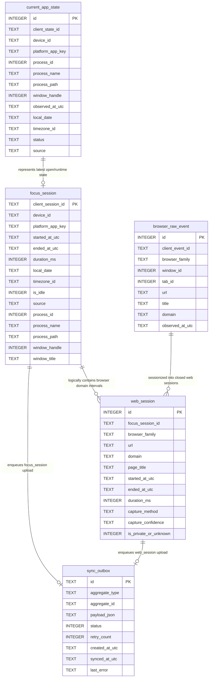
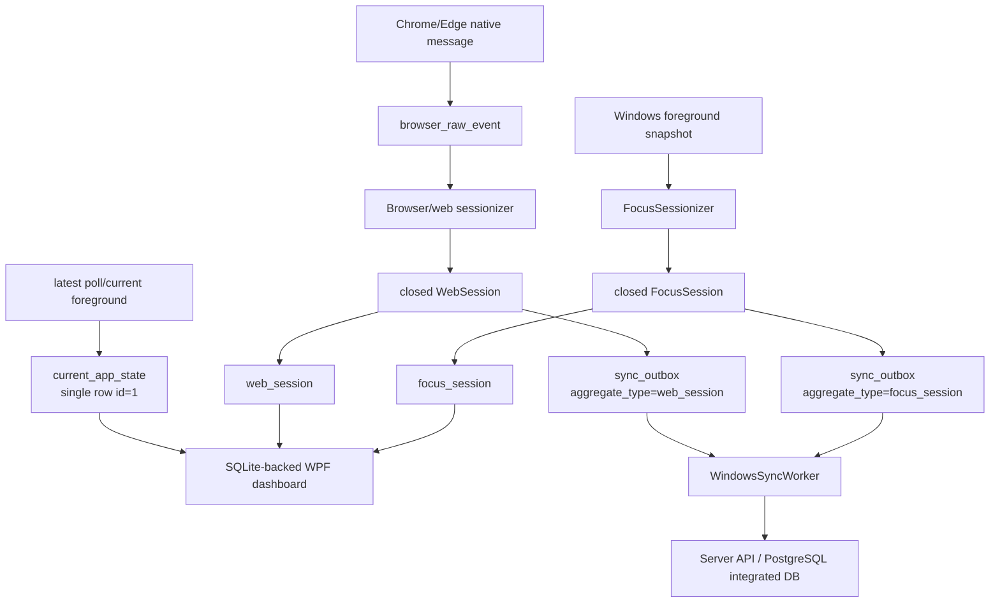
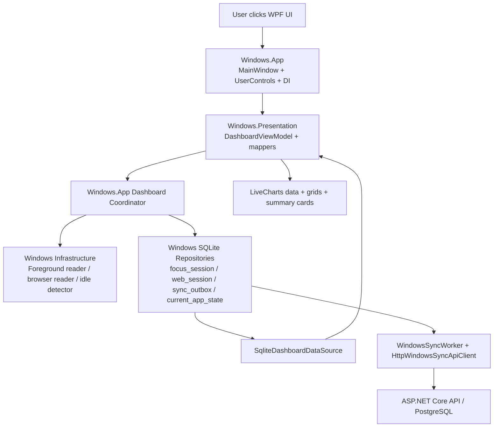
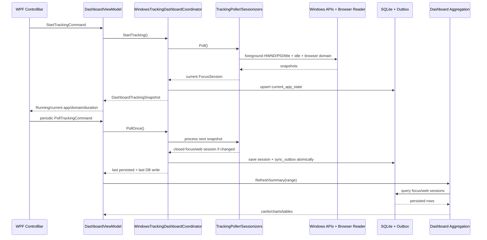
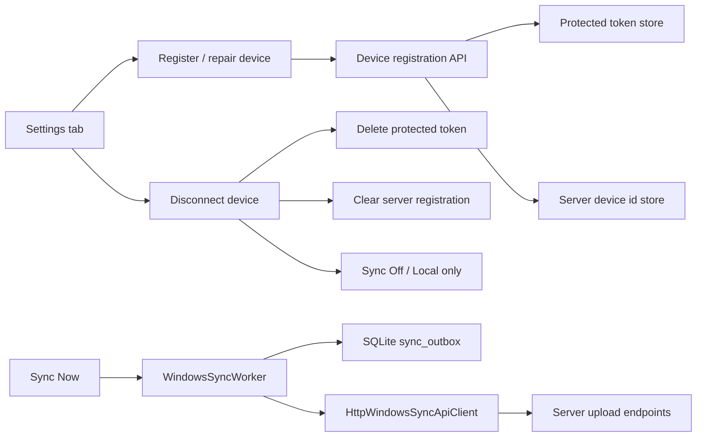

# WPF Feature Map

This document maps the Windows WPF functionality to the source code locations
that implement it. The WPF app is split into:

- `Woong.MonitorStack.Windows.App`: WPF UI, composition root, DI, lifecycle, UI adapters.
- `Woong.MonitorStack.Windows.Presentation`: MVVM state, commands, mappers, chart/table display models.
- `Woong.MonitorStack.Windows`: Windows-specific tracking, browser metadata, SQLite storage, sync.

The product remains a metadata-based productivity statistics tool. It must not
collect typed text, passwords, form input, clipboard contents, page contents,
messages, screen recordings, or hidden surveillance data.

## Feature Map

| Feature | Purpose | Code |
|---|---|---|
| App boot / DI Host | Start WPF through Generic Host and resolve `MainWindow` from DI. | [App.xaml.cs](../src/Woong.MonitorStack.Windows.App/App.xaml.cs), [WindowsAppServiceCollectionExtensions.cs](../src/Woong.MonitorStack.Windows.App/WindowsAppServiceCollectionExtensions.cs) |
| MainWindow shell | Window shell, DataContext, lifecycle coordinator hookup. | [MainWindow.xaml.cs](../src/Woong.MonitorStack.Windows.App/MainWindow.xaml.cs) |
| Dashboard layout | Header, control bar, current focus, summary, charts, details tabs. | [DashboardView.xaml](../src/Woong.MonitorStack.Windows.App/Views/DashboardView.xaml) |
| Header status badges | Tracking / Sync / Privacy badges. | [HeaderStatusBar.xaml](../src/Woong.MonitorStack.Windows.App/Views/HeaderStatusBar.xaml) |
| Start / Stop / Refresh / Sync / Period filters | Tracking controls and Today/1h/6h/24h/Custom range selection. | [ControlBar.xaml](../src/Woong.MonitorStack.Windows.App/Views/ControlBar.xaml), [DashboardViewModel.cs](../src/Woong.MonitorStack.Windows.Presentation/Dashboard/DashboardViewModel.cs) |
| Custom range | Date/time range editing and application. | [ControlBar.xaml](../src/Woong.MonitorStack.Windows.App/Views/ControlBar.xaml), [DashboardPeriodRangeResolver.cs](../src/Woong.MonitorStack.Windows.Presentation/Dashboard/DashboardPeriodRangeResolver.cs) |
| Current Focus panel | Current app/process/window/domain/duration/DB write/sync state. | [CurrentFocusPanel.xaml](../src/Woong.MonitorStack.Windows.App/Views/CurrentFocusPanel.xaml), [DashboardViewModel.cs](../src/Woong.MonitorStack.Windows.Presentation/Dashboard/DashboardViewModel.cs) |
| Runtime ticker and lifecycle | Auto-start, periodic polling, close flush, tray minimize. | [MainWindowLifecycleCoordinator.cs](../src/Woong.MonitorStack.Windows.App/Runtime/MainWindowLifecycleCoordinator.cs) |
| Foreground window reader | HWND, PID, process name/path, window title metadata. | [WindowsForegroundWindowReader.cs](../src/Woong.MonitorStack.Windows/Tracking/WindowsForegroundWindowReader.cs) |
| Focus sessionization | Start/close focus sessions when foreground identity or idle state changes. | [FocusSessionizer.cs](../src/Woong.MonitorStack.Windows/Tracking/FocusSessionizer.cs) |
| Tracking coordinator | Orchestrates Start/Poll/Stop, focus persistence, browser persistence, current app state. | [WindowsTrackingDashboardCoordinator.cs](../src/Woong.MonitorStack.Windows.App/Dashboard/WindowsTrackingDashboardCoordinator.cs) |
| Browser process classification | Identifies supported browser processes such as Chrome, Edge, Firefox, Brave. | [BrowserProcessClassifier.cs](../src/Woong.MonitorStack.Windows/Browser/BrowserProcessClassifier.cs) |
| Browser URL privacy | Applies domain-only/full-url/off storage policy. | [BrowserUrlSanitizer.cs](../src/Woong.MonitorStack.Windows/Browser/BrowserUrlSanitizer.cs) |
| Chrome native ingestion | Native-message browser metadata ingestion with atomic raw/web/outbox writes. | [ChromeNativeMessageIngestionFlow.cs](../src/Woong.MonitorStack.Windows/Browser/ChromeNativeMessageIngestionFlow.cs) |
| Focus SQLite persistence | Saves `focus_session` and matching `sync_outbox` row atomically. | [SqliteFocusSessionRepository.cs](../src/Woong.MonitorStack.Windows/Storage/SqliteFocusSessionRepository.cs), [WindowsFocusSessionPersistenceService.cs](../src/Woong.MonitorStack.Windows/Storage/WindowsFocusSessionPersistenceService.cs) |
| Web SQLite persistence | Saves `web_session` and matching `sync_outbox` row with privacy policy. | [SqliteWebSessionRepository.cs](../src/Woong.MonitorStack.Windows/Storage/SqliteWebSessionRepository.cs), [WindowsWebSessionPersistenceService.cs](../src/Woong.MonitorStack.Windows/Storage/WindowsWebSessionPersistenceService.cs) |
| Current app state persistence | Stores latest current app state as metadata-only SQLite row. | [SqliteCurrentAppStateRepository.cs](../src/Woong.MonitorStack.Windows/Storage/SqliteCurrentAppStateRepository.cs), [WindowsCurrentAppStatePersistenceService.cs](../src/Woong.MonitorStack.Windows/Storage/WindowsCurrentAppStatePersistenceService.cs) |
| SQLite-backed dashboard | Reads persisted SQLite focus/web sessions for dashboard refresh. | [SqliteDashboardDataSource.cs](../src/Woong.MonitorStack.Windows.App/Dashboard/SqliteDashboardDataSource.cs) |
| Summary cards | Computes Active Focus, Foreground, Idle, and Web Focus. | [DashboardSummaryBuilder.cs](../src/Woong.MonitorStack.Windows.Presentation/Dashboard/DashboardSummaryBuilder.cs) |
| Charts | Builds hourly/app/domain points and LiveCharts data. | [DashboardChartMapper.cs](../src/Woong.MonitorStack.Windows.Presentation/Dashboard/DashboardChartMapper.cs), [DashboardLiveChartsMapper.cs](../src/Woong.MonitorStack.Windows.Presentation/Dashboard/DashboardLiveChartsMapper.cs) |
| Details tabs | App Sessions, Web Sessions, Live Event Log, Settings tabs. | [DetailsTabsPanel.xaml](../src/Woong.MonitorStack.Windows.App/Views/DetailsTabsPanel.xaml), [DashboardRowMapper.cs](../src/Woong.MonitorStack.Windows.Presentation/Dashboard/DashboardRowMapper.cs) |
| Privacy settings | Window title/page title/full URL/domain-only controls. | [SettingsPanel.xaml](../src/Woong.MonitorStack.Windows.App/Views/SettingsPanel.xaml) |
| Local DB operations | Create/switch/load/delete local SQLite DB. | [SettingsPanel.xaml](../src/Woong.MonitorStack.Windows.App/Views/SettingsPanel.xaml), [WindowsDashboardDatabaseController.cs](../src/Woong.MonitorStack.Windows.App/Dashboard/WindowsDashboardDatabaseController.cs) |
| Runtime log | Runtime log path, folder opening, exception/event writes. | [WindowsDashboardRuntimeLogSink.cs](../src/Woong.MonitorStack.Windows.App/Dashboard/WindowsDashboardRuntimeLogSink.cs), [DashboardViewModel.cs](../src/Woong.MonitorStack.Windows.Presentation/Dashboard/DashboardViewModel.cs) |
| Sync Now | Uploads pending/failed local outbox rows. | [WindowsSyncWorker.cs](../src/Woong.MonitorStack.Windows/Sync/WindowsSyncWorker.cs), [HttpWindowsSyncApiClient.cs](../src/Woong.MonitorStack.Windows/Sync/HttpWindowsSyncApiClient.cs) |
| Device register / repair | Registers device and stores protected token/server device id. | [WindowsDashboardSyncRegistrationService.cs](../src/Woong.MonitorStack.Windows.App/Dashboard/WindowsDashboardSyncRegistrationService.cs) |
| Disconnect device | Deletes protected token and registration; returns to Local only. | [DashboardViewModel.cs](../src/Woong.MonitorStack.Windows.Presentation/Dashboard/DashboardViewModel.cs), [WindowsDashboardSyncRegistrationService.cs](../src/Woong.MonitorStack.Windows.App/Dashboard/WindowsDashboardSyncRegistrationService.cs) |
| System tray lifecycle | Hide/restore/explicit exit behavior and tray icon. | [WindowsTrayLifecycleService.cs](../src/Woong.MonitorStack.Windows.App/Runtime/WindowsTrayLifecycleService.cs) |
| UI snapshots / semantic acceptance | Launches app, interacts with UI, captures screenshots and reports. | [Windows.UiSnapshots Program.cs](../tools/Woong.MonitorStack.Windows.UiSnapshots/Program.cs) |
| RealStart acceptance | Launches real WPF app and verifies SQLite `focus_session` + `sync_outbox`. | [Windows.RealStartAcceptance Program.cs](../tools/Woong.MonitorStack.Windows.RealStartAcceptance/Program.cs) |

## Representative Tests

| Area | Tests |
|---|---|
| Start/Poll/Stop and persistence | [WindowsTrackingDashboardCoordinatorTests.cs](../tests/Woong.MonitorStack.Windows.App.Tests/WindowsTrackingDashboardCoordinatorTests.cs) |
| MainWindow buttons/status/charts | [MainWindowUiExpectationTests.cs](../tests/Woong.MonitorStack.Windows.App.Tests/MainWindowUiExpectationTests.cs) |
| Settings, Register, Disconnect | [DashboardTrackingStateTests.cs](../tests/Woong.MonitorStack.Windows.Presentation.Tests/Dashboard/DashboardTrackingStateTests.cs), [WindowsSyncRegistrationServiceTests.cs](../tests/Woong.MonitorStack.Windows.App.Tests/WindowsSyncRegistrationServiceTests.cs) |
| Summary aggregation | [DashboardSummaryBuilderTests.cs](../tests/Woong.MonitorStack.Windows.Presentation.Tests/Dashboard/DashboardSummaryBuilderTests.cs) |
| Chart labels and top app/domain mapping | [DashboardChartMapperTests.cs](../tests/Woong.MonitorStack.Windows.Presentation.Tests/Dashboard/DashboardChartMapperTests.cs) |
| Sync worker/outbox state | [WindowsSyncWorkerTests.cs](../tests/Woong.MonitorStack.Windows.Tests/Sync/WindowsSyncWorkerTests.cs) |
| WPF UI acceptance scripts | [WpfUiAcceptanceScriptTests.cs](../tests/Woong.MonitorStack.Windows.App.Tests/WpfUiAcceptanceScriptTests.cs) |

## WPF Local SQLite Table Structure

The WPF app uses a local SQLite database for Windows-only data. It does not read
Android Room tables directly, and PostgreSQL remains the only integrated
Windows + Android database.

### Beginner Q&A: How The Tables Connect

#### What is the relationship between `current_app_state` and `focus_session`?

`current_app_state` is the latest foreground app state. It is a single-row
runtime snapshot, like "what app is being watched right now?"

`focus_session` is the historical record created after a foreground interval is
closed. When the user switches apps, becomes idle, stops tracking, or the app
flushes the current open interval, the previously current app can become a
closed `focus_session` row.

Example:

```text
09:00 Chrome becomes foreground
current_app_state = Chrome

09:10 Chrome is still foreground
current_app_state = Chrome
focus_session may not have a closed Chrome row yet

09:20 User switches to VS Code
current_app_state = VS Code
focus_session receives Chrome 09:00-09:20
```

This relationship is conceptual. The current table does not have a
`focus_session_id` foreign key. The runtime coordinator converts open state into
closed session records.

#### What do Mermaid symbols such as `||`, `o|`, and `o{` mean?

The diagrams use Mermaid ER notation:

```text
|| = exactly one
o| = zero or one
o{ = zero or many
|{ = one or many
```

So:

```text
focus_session ||--o{ web_session
```

means one focus session can have zero or many web sessions. A VS Code focus
session usually has no web sessions, while a Chrome focus session can contain
multiple domain intervals such as `github.com`, `chatgpt.com`, and
`youtube.com`.

#### Why does `browser_raw_event` look different from `web_session`?

`browser_raw_event` is not the final statistics table. It stores browser
native-message events such as "tab/domain changed at this observed time."

It has `observed_at_utc`, `tab_id`, and `window_id` because each row is one raw
browser event. It does not have `started_at_utc`, `ended_at_utc`, or
`duration_ms` because duration is calculated later when raw events are
sessionized into `web_session` rows.

Example:

```text
browser_raw_event:
09:00 tab 12 domain github.com
09:10 tab 12 domain chatgpt.com
09:25 tab 12 domain youtube.com

web_session:
github.com  09:00-09:10  10m
chatgpt.com 09:10-09:25  15m
youtube.com 09:25-09:30   5m
```

Important: `browser_raw_event.window_id` is the browser extension window id, not
the Windows `HWND`. It must not be joined directly to
`focus_session.window_handle`.

#### Does `focus_session_id` appear every hour?

No. A focus session id is created when an app/window focus interval becomes a
session. It is not an hourly id. It is tied to a usage interval.

If Chrome remains foreground for three hours without a focus/idle boundary, it
can be one long focus session:

```text
Chrome 09:00-12:00
client_session_id = A
```

If the user switches apps every ten minutes, each closed interval gets its own
primary key:

```text
09:00-09:10 Chrome  client_session_id = A
09:10-09:20 VS Code client_session_id = B
09:20-09:30 Chrome  client_session_id = C
```

In this project:

```text
focus_session.client_session_id = primary key for one app/window usage record
web_session.focus_session_id = the focus-session id that a browser/domain record belongs to
```

#### How are tables linked if SQLite does not define `FOREIGN KEY` constraints?

The application code writes matching identifiers into related rows.

For focus uploads:

```text
focus_session.client_session_id
= sync_outbox.aggregate_id where aggregate_type = "focus_session"
```

For web sessions:

```text
focus_session.client_session_id
= web_session.focus_session_id
```

For web uploads, the code creates an aggregate id from the focus session id and
web session start time:

```text
sync_outbox.aggregate_type = "web_session"
sync_outbox.aggregate_id = "{web_session.focus_session_id}:{web_session.started_at_utc}"
```

So the relationship is enforced by repository/persistence code rather than by
SQLite foreign-key declarations.

### Table Overview

| Table | Purpose | Written by | Read by | Sync behavior |
|---|---|---|---|---|
| `focus_session` | Closed Windows foreground app/window sessions. | `SqliteFocusSessionRepository`, `WindowsFocusSessionPersistenceService` | `SqliteDashboardDataSource`, acceptance tools, sync worker payload source | A matching `sync_outbox` item is created atomically on insert. |
| `web_session` | Closed browser domain sessions linked to a focus session. | `SqliteWebSessionRepository`, `SqliteBrowserIngestionRepository`, `WindowsWebSessionPersistenceService` | `SqliteDashboardDataSource`, chart/detail mappers | A matching `sync_outbox` item is created atomically on insert when produced by persistence/ingestion flow. |
| `sync_outbox` | Pending/failed/synced upload queue. | `SqliteSyncOutboxRepository`, `SqliteSyncOutboxCommands` | `WindowsSyncWorker` | `status`, `retry_count`, `synced_at_utc`, and `last_error` track upload lifecycle. |
| `current_app_state` | Single-row current foreground app snapshot for runtime UI and local bridge current-state reads. | `SqliteCurrentAppStateRepository`, `WindowsCurrentAppStatePersistenceService` | WPF current focus UI, local integrated dashboard bridge | Metadata-only state; not a historical session table. |
| `browser_raw_event` | Browser native-message raw tab/domain events before/during web sessionization. | `SqliteBrowserRawEventRepository`, `SqliteBrowserIngestionRepository` | Browser sessionizer/ingestion diagnostics | Retention policy can delete older rows; unique `client_event_id` prevents duplicate native messages. |

### Logical Relationship Diagram



### Table Details

#### `focus_session`

| Column | Type | Null | Meaning |
|---|---:|---:|---|
| `client_session_id` | `TEXT` | No | Client-generated idempotency key and primary key. |
| `device_id` | `TEXT` | No | Local device identity used in sync payloads. |
| `platform_app_key` | `TEXT` | No | Windows app/process key used for grouping. |
| `started_at_utc` | `TEXT` | No | Session start instant in UTC ISO-8601 text. |
| `ended_at_utc` | `TEXT` | No | Session end instant in UTC ISO-8601 text. |
| `duration_ms` | `INTEGER` | No | Persisted duration in milliseconds. |
| `local_date` | `TEXT` | No | Display/reporting local date derived from timezone. |
| `timezone_id` | `TEXT` | No | Timezone used for local-date calculation. |
| `is_idle` | `INTEGER` | No | `0` active foreground, `1` idle foreground interval. |
| `source` | `TEXT` | No | Source label for Windows tracking. |
| `process_id` | `INTEGER` | Yes | Foreground process id when available. |
| `process_name` | `TEXT` | Yes | Foreground process name, such as `chrome.exe`. |
| `process_path` | `TEXT` | Yes | Executable path when safely available. |
| `window_handle` | `INTEGER` | Yes | Foreground HWND value. |
| `window_title` | `TEXT` | Yes | Window title only when privacy policy allows it; otherwise null. |

Indexes:

- `ix_focus_session_started_at_utc` on `started_at_utc`

#### `web_session`

| Column | Type | Null | Meaning |
|---|---:|---:|---|
| `id` | `INTEGER` | No | SQLite autoincrement row id. |
| `focus_session_id` | `TEXT` | No | Logical link to `focus_session.client_session_id`. |
| `browser_family` | `TEXT` | No | Browser family such as Chrome/Edge/Firefox/Brave. |
| `url` | `TEXT` | Yes | Full URL only when explicit full-url opt-in is enabled. |
| `domain` | `TEXT` | No | Privacy-safe domain used for dashboard grouping. |
| `page_title` | `TEXT` | Yes | Page title only when privacy policy allows it. |
| `started_at_utc` | `TEXT` | No | Web/domain interval start in UTC. |
| `ended_at_utc` | `TEXT` | No | Web/domain interval end in UTC. |
| `duration_ms` | `INTEGER` | No | Web/domain interval duration in milliseconds. |
| `capture_method` | `TEXT` | Yes | Capture source, for example native messaging. |
| `capture_confidence` | `TEXT` | Yes | Confidence label, for example medium/high. |
| `is_private_or_unknown` | `INTEGER` | Yes | Nullable boolean for private/unknown browser state. |

Indexes:

- `ix_web_session_focus_session_id` on `focus_session_id`
- `ux_web_session_focus_session_started_at_utc` unique on `(focus_session_id, started_at_utc)`

#### `sync_outbox`

| Column | Type | Null | Meaning |
|---|---:|---:|---|
| `id` | `TEXT` | No | Outbox item id and primary key. |
| `aggregate_type` | `TEXT` | No | Upload type, such as `focus_session` or `web_session`. |
| `aggregate_id` | `TEXT` | No | Idempotency identity of the uploaded aggregate. |
| `payload_json` | `TEXT` | No | API DTO JSON payload. |
| `status` | `INTEGER` | No | Pending/failed/synced enum value. |
| `retry_count` | `INTEGER` | No | Failed upload attempt count. |
| `created_at_utc` | `TEXT` | No | Outbox creation time in UTC. |
| `synced_at_utc` | `TEXT` | Yes | Successful upload time in UTC. |
| `last_error` | `TEXT` | Yes | Last upload failure message. |

Indexes:

- `ix_sync_outbox_status` on `(status, created_at_utc)`
- `ux_sync_outbox_aggregate_identity` unique on `(aggregate_type, aggregate_id)`

#### `current_app_state`

| Column | Type | Null | Meaning |
|---|---:|---:|---|
| `id` | `INTEGER` | No | Single-row primary key constrained to `1`. |
| `client_state_id` | `TEXT` | No | Current-state idempotency key. |
| `device_id` | `TEXT` | No | Local device identity. |
| `platform_app_key` | `TEXT` | No | Current app/process grouping key. |
| `process_id` | `INTEGER` | Yes | Current foreground process id. |
| `process_name` | `TEXT` | Yes | Current process name. |
| `process_path` | `TEXT` | Yes | Current executable path when available. |
| `window_handle` | `INTEGER` | Yes | Current foreground HWND. |
| `observed_at_utc` | `TEXT` | No | Last poll observation time in UTC. |
| `local_date` | `TEXT` | No | Local date for display/report boundary. |
| `timezone_id` | `TEXT` | No | Timezone used for local display. |
| `status` | `TEXT` | No | Runtime state, such as running/stopped. |
| `source` | `TEXT` | No | Source label, usually `windows_current_app_state`. |

Privacy note: this table intentionally does not store window title, URL, page
title, typed text, clipboard, or screen contents.

#### `browser_raw_event`

| Column | Type | Null | Meaning |
|---|---:|---:|---|
| `id` | `INTEGER` | No | SQLite autoincrement row id. |
| `client_event_id` | `TEXT` | No | Native-message event id used for duplicate suppression. |
| `browser_family` | `TEXT` | No | Browser family. |
| `window_id` | `INTEGER` | No | Browser extension window id, not HWND. |
| `tab_id` | `INTEGER` | No | Browser extension tab id. |
| `url` | `TEXT` | Yes | URL as allowed by browser privacy policy. |
| `title` | `TEXT` | Yes | Page title as allowed by browser privacy policy. |
| `domain` | `TEXT` | Yes | Extracted/sanitized domain. |
| `observed_at_utc` | `TEXT` | No | Browser event observation time in UTC. |

Indexes:

- `ix_browser_raw_event_tab_time` on `(tab_id, observed_at_utc)`
- `ux_browser_raw_event_client_event_id` unique on `client_event_id`

### Persistence Flow Diagram



## Layer Diagram



## Runtime Tracking Diagram



## Sync And Registration Diagram



## Privacy Boundary

Allowed WPF metadata:

- foreground app/process/window metadata
- session start/end/duration
- idle state
- browser domain when available and privacy-safe
- local DB/sync state

Forbidden data:

- keylogging or typed text
- passwords, messages, form input
- clipboard contents
- browser page contents
- screenshots of user activity
- hidden/covert tracking
